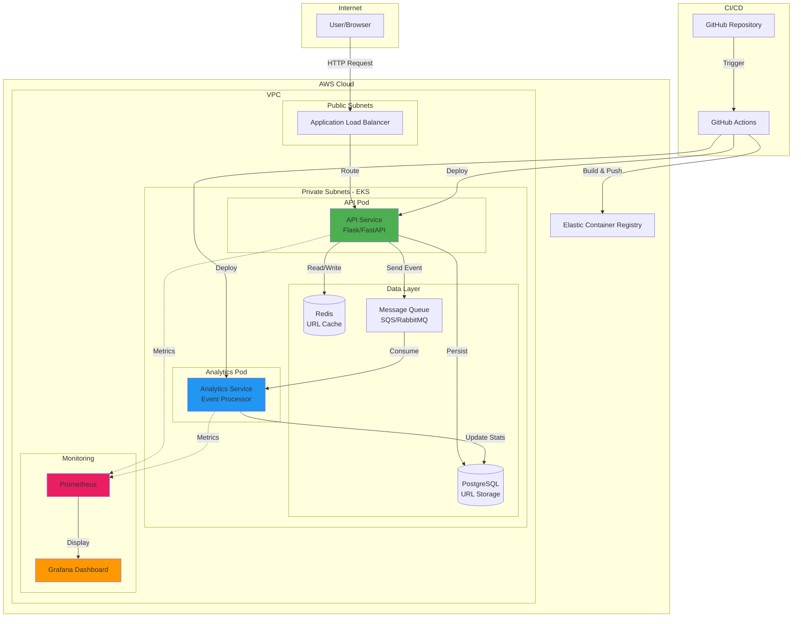
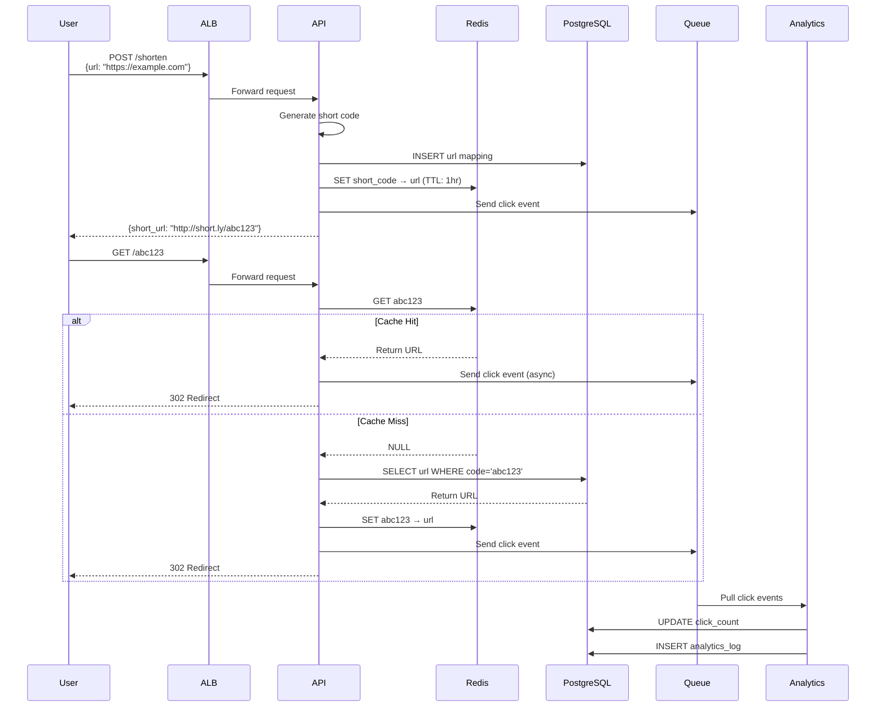
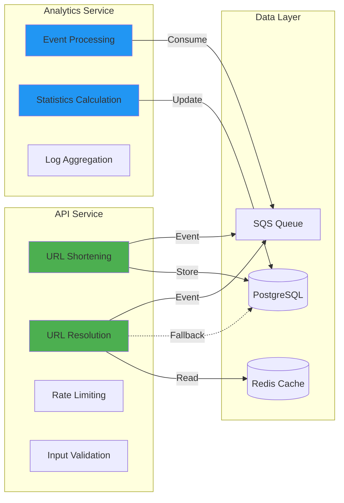

# Project 1: URL Shortener Microservices on AWS EKS

**Difficulty:** Intermediate  
**Time Estimate:** 4-6 hours  
**Cost:** <$50/month (destroy resources between testing)

---

## Table of Contents
- [Overview](#overview)
- [Architecture](#architecture)
- [Requirements](#requirements)
- [Solution](#solution)
- [Testing](#testing)
- [Evaluation](#evaluation)

---

## Overview

### Business Context
Build a production-grade URL shortener service that demonstrates your ability to design microservices, containerize applications, orchestrate with Kubernetes, implement CI/CD, and set up observability.

### Learning Objectives
By completing this project, you will demonstrate:
- Microservices architecture design
- Container orchestration with Kubernetes/EKS
- Infrastructure as Code with Terraform
- CI/CD pipeline implementation
- Observability and monitoring setup
- Database integration in a cloud-native environment

---

## Architecture

### High-Level Architecture



### Data Flow Diagram



### Component Responsibilities



---

## Requirements

### Functional Requirements

#### API Service
- [ ] `POST /shorten` - Creates a short URL from a long URL
  - Input validation (valid URL format)
  - Collision detection
  - Custom short code support (optional)
- [ ] `GET /{short_code}` - Redirects to original URL (302)
  - Cache-first lookup
  - 404 if not found
- [ ] `GET /stats/{short_code}` - Returns click statistics
  - Total clicks
  - Recent activity
  - Geographic data (bonus)

#### Analytics Service
- [ ] Consumes click events from queue
- [ ] Updates click counters
- [ ] Stores detailed analytics logs
- [ ] Handles event deduplication

### Technical Requirements

#### Infrastructure (Terraform)
- [ ] VPC with public/private subnets (2 AZs minimum)
- [ ] EKS cluster (1.28+)
- [ ] RDS PostgreSQL instance (or in-cluster PostgreSQL)
- [ ] ElastiCache Redis (or in-cluster Redis)
- [ ] SQS queue for events
- [ ] Application Load Balancer
- [ ] ECR repositories for Docker images
- [ ] Appropriate security groups and IAM roles

#### Kubernetes Manifests
- [ ] Deployments for API and Analytics services
- [ ] Services (ClusterIP for internal, LoadBalancer for ALB)
- [ ] ConfigMaps for configuration
- [ ] Secrets for credentials
- [ ] HorizontalPodAutoscaler (HPA)
- [ ] Resource requests and limits
- [ ] Liveness and readiness probes

#### CI/CD Pipeline
- [ ] Automated testing (unit tests)
- [ ] Docker image build
- [ ] Security scanning (Trivy)
- [ ] Push to ECR
- [ ] Deploy to EKS
- [ ] Rolling update strategy

#### Monitoring
- [ ] Health check endpoints (`/health`, `/ready`)
- [ ] Prometheus metrics export
- [ ] Grafana dashboard
- [ ] At least one alert rule

---

## Solution

### Directory Structure

```
url-shortener-eks/
├── README.md
├── docs/
│   ├── architecture.md
│   ├── api-documentation.md
│   └── deployment-guide.md
├── terraform/
│   ├── main.tf
│   ├── variables.tf
│   ├── outputs.tf
│   ├── vpc.tf
│   ├── eks.tf
│   ├── rds.tf
│   ├── elasticache.tf
│   ├── sqs.tf
│   └── iam.tf
├── kubernetes/
│   ├── api-service/
│   │   ├── deployment.yaml
│   │   ├── service.yaml
│   │   ├── hpa.yaml
│   │   └── configmap.yaml
│   ├── analytics-service/
│   │   ├── deployment.yaml
│   │   ├── service.yaml
│   │   └── configmap.yaml
│   └── monitoring/
│       ├── prometheus.yaml
│       └── grafana.yaml
├── services/
│   ├── api/
│   │   ├── Dockerfile
│   │   ├── app.py
│   │   ├── requirements.txt
│   │   ├── models.py
│   │   └── tests/
│   └── analytics/
│       ├── Dockerfile
│       ├── processor.py
│       ├── requirements.txt
│       └── tests/
└── .github/
    └── workflows/
        ├── api-service.yml
        └── analytics-service.yml
```

### Terraform Infrastructure

#### main.tf
```hcl
terraform {
  required_version = ">= 1.5"
  
  required_providers {
    aws = {
      source  = "hashicorp/aws"
      version = "~> 5.0"
    }
    kubernetes = {
      source  = "hashicorp/kubernetes"
      version = "~> 2.23"
    }
  }
  
  backend "s3" {
    bucket = "url-shortener-terraform-state"
    key    = "prod/terraform.tfstate"
    region = "us-east-1"
  }
}

provider "aws" {
  region = var.aws_region
  
  default_tags {
    tags = {
      Project     = "url-shortener"
      Environment = var.environment
      ManagedBy   = "terraform"
    }
  }
}

data "aws_eks_cluster_auth" "cluster" {
  name = module.eks.cluster_name
}

provider "kubernetes" {
  host                   = module.eks.cluster_endpoint
  cluster_ca_certificate = base64decode(module.eks.cluster_certificate_authority_data)
  token                  = data.aws_eks_cluster_auth.cluster.token
}
```

#### variables.tf
```hcl
variable "aws_region" {
  description = "AWS region"
  type        = string
  default     = "us-east-1"
}

variable "environment" {
  description = "Environment name"
  type        = string
  default     = "prod"
}

variable "cluster_name" {
  description = "EKS cluster name"
  type        = string
  default     = "url-shortener-eks"
}

variable "vpc_cidr" {
  description = "VPC CIDR block"
  type        = string
  default     = "10.0.0.0/16"
}

variable "db_username" {
  description = "Database master username"
  type        = string
  sensitive   = true
}

variable "db_password" {
  description = "Database master password"
  type        = string
  sensitive   = true
}
```

#### vpc.tf
```hcl
module "vpc" {
  source  = "terraform-aws-modules/vpc/aws"
  version = "~> 5.0"

  name = "${var.cluster_name}-vpc"
  cidr = var.vpc_cidr

  azs             = ["${var.aws_region}a", "${var.aws_region}b", "${var.aws_region}c"]
  private_subnets = ["10.0.1.0/24", "10.0.2.0/24", "10.0.3.0/24"]
  public_subnets  = ["10.0.101.0/24", "10.0.102.0/24", "10.0.103.0/24"]
  database_subnets = ["10.0.201.0/24", "10.0.202.0/24"]

  enable_nat_gateway   = true
  single_nat_gateway   = false  # Use one NAT per AZ for HA
  enable_dns_hostnames = true
  enable_dns_support   = true

  # Tags required for EKS
  public_subnet_tags = {
    "kubernetes.io/role/elb" = "1"
    "kubernetes.io/cluster/${var.cluster_name}" = "shared"
  }

  private_subnet_tags = {
    "kubernetes.io/role/internal-elb" = "1"
    "kubernetes.io/cluster/${var.cluster_name}" = "shared"
  }
}
```

#### eks.tf
```hcl
module "eks" {
  source  = "terraform-aws-modules/eks/aws"
  version = "~> 19.0"

  cluster_name    = var.cluster_name
  cluster_version = "1.28"

  vpc_id     = module.vpc.vpc_id
  subnet_ids = module.vpc.private_subnets

  # Cluster access
  cluster_endpoint_public_access  = true
  cluster_endpoint_private_access = true

  # OIDC Identity provider
  enable_irsa = true

  # Node groups
  eks_managed_node_groups = {
    application = {
      name = "${var.cluster_name}-app-nodes"
      
      instance_types = ["t3.medium"]
      capacity_type  = "ON_DEMAND"
      
      min_size     = 2
      max_size     = 4
      desired_size = 2

      disk_size = 50

      labels = {
        workload = "application"
      }

      tags = {
        NodeGroup = "application"
      }
    }
  }

  # Cluster security group rules
  cluster_security_group_additional_rules = {
    ingress_nodes_ephemeral_ports_tcp = {
      description                = "Nodes on ephemeral ports"
      protocol                   = "tcp"
      from_port                  = 1025
      to_port                    = 65535
      type                       = "ingress"
      source_node_security_group = true
    }
  }

  # Node security group rules
  node_security_group_additional_rules = {
    ingress_self_all = {
      description = "Node to node all ports/protocols"
      protocol    = "-1"
      from_port   = 0
      to_port     = 0
      type        = "ingress"
      self        = true
    }
    
    ingress_cluster_all = {
      description                   = "Cluster to node all ports/protocols"
      protocol                      = "-1"
      from_port                     = 0
      to_port                       = 0
      type                          = "ingress"
      source_cluster_security_group = true
    }
    
    egress_all = {
      description = "Node all egress"
      protocol    = "-1"
      from_port   = 0
      to_port     = 0
      type        = "egress"
      cidr_blocks = ["0.0.0.0/0"]
    }
  }
}
```

#### rds.tf
```hcl
resource "aws_db_subnet_group" "main" {
  name       = "${var.cluster_name}-db-subnet"
  subnet_ids = module.vpc.database_subnets

  tags = {
    Name = "${var.cluster_name}-db-subnet-group"
  }
}

resource "aws_security_group" "rds" {
  name_prefix = "${var.cluster_name}-rds-"
  vpc_id      = module.vpc.vpc_id

  ingress {
    from_port       = 5432
    to_port         = 5432
    protocol        = "tcp"
    security_groups = [module.eks.node_security_group_id]
  }

  egress {
    from_port   = 0
    to_port     = 0
    protocol    = "-1"
    cidr_blocks = ["0.0.0.0/0"]
  }

  tags = {
    Name = "${var.cluster_name}-rds-sg"
  }
}

resource "aws_db_instance" "postgres" {
  identifier = "${var.cluster_name}-db"

  engine               = "postgres"
  engine_version       = "15.4"
  instance_class       = "db.t3.micro"
  allocated_storage    = 20
  storage_encrypted    = true

  db_name  = "urlshortener"
  username = var.db_username
  password = var.db_password

  db_subnet_group_name   = aws_db_subnet_group.main.name
  vpc_security_group_ids = [aws_security_group.rds.id]

  backup_retention_period = 7
  backup_window          = "03:00-04:00"
  maintenance_window     = "mon:04:00-mon:05:00"

  skip_final_snapshot = true  # Set to false in production

  tags = {
    Name = "${var.cluster_name}-postgres"
  }
}
```

#### elasticache.tf
```hcl
resource "aws_elasticache_subnet_group" "main" {
  name       = "${var.cluster_name}-redis-subnet"
  subnet_ids = module.vpc.private_subnets
}

resource "aws_security_group" "redis" {
  name_prefix = "${var.cluster_name}-redis-"
  vpc_id      = module.vpc.vpc_id

  ingress {
    from_port       = 6379
    to_port         = 6379
    protocol        = "tcp"
    security_groups = [module.eks.node_security_group_id]
  }

  egress {
    from_port   = 0
    to_port     = 0
    protocol    = "-1"
    cidr_blocks = ["0.0.0.0/0"]
  }

  tags = {
    Name = "${var.cluster_name}-redis-sg"
  }
}

resource "aws_elasticache_cluster" "redis" {
  cluster_id           = "${var.cluster_name}-redis"
  engine               = "redis"
  node_type            = "cache.t3.micro"
  num_cache_nodes      = 1
  parameter_group_name = "default.redis7"
  engine_version       = "7.0"
  port                 = 6379

  subnet_group_name  = aws_elasticache_subnet_group.main.name
  security_group_ids = [aws_security_group.redis.id]

  tags = {
    Name = "${var.cluster_name}-redis"
  }
}
```

#### sqs.tf
```hcl
resource "aws_sqs_queue" "click_events" {
  name                      = "${var.cluster_name}-click-events"
  delay_seconds             = 0
  max_message_size          = 262144
  message_retention_seconds = 345600  # 4 days
  receive_wait_time_seconds = 10
  visibility_timeout_seconds = 30

  tags = {
    Name = "${var.cluster_name}-click-events"
  }
}

resource "aws_sqs_queue_policy" "click_events" {
  queue_url = aws_sqs_queue.click_events.id

  policy = jsonencode({
    Version = "2012-10-17"
    Statement = [
      {
        Sid    = "AllowEKSSendMessage"
        Effect = "Allow"
        Principal = {
          AWS = module.eks.cluster_iam_role_arn
        }
        Action = [
          "sqs:SendMessage",
          "sqs:ReceiveMessage",
          "sqs:DeleteMessage"
        ]
        Resource = aws_sqs_queue.click_events.arn
      }
    ]
  })
}
```

#### outputs.tf
```hcl
output "cluster_endpoint" {
  description = "EKS cluster endpoint"
  value       = module.eks.cluster_endpoint
}

output "cluster_name" {
  description = "EKS cluster name"
  value       = module.eks.cluster_name
}

output "rds_endpoint" {
  description = "RDS instance endpoint"
  value       = aws_db_instance.postgres.endpoint
  sensitive   = true
}

output "redis_endpoint" {
  description = "Redis cluster endpoint"
  value       = aws_elasticache_cluster.redis.cache_nodes[0].address
}

output "sqs_queue_url" {
  description = "SQS queue URL"
  value       = aws_sqs_queue.click_events.url
}
```

### Application Code

#### services/api/app.py
```python
from fastapi import FastAPI, HTTPException, Request
from fastapi.responses import RedirectResponse
from pydantic import BaseModel, HttpUrl
import redis
import psycopg2
from psycopg2.extras import RealDictCursor
import boto3
import hashlib
import string
import random
import os
import logging
from prometheus_client import Counter, Histogram, generate_latest, CONTENT_TYPE_LATEST
from starlette.responses import Response

# Logging
logging.basicConfig(level=logging.INFO)
logger = logging.getLogger(__name__)

# Prometheus metrics
REQUESTS_TOTAL = Counter('api_requests_total', 'Total API requests', ['method', 'endpoint', 'status'])
REQUEST_DURATION = Histogram('api_request_duration_seconds', 'Request duration', ['method', 'endpoint'])

app = FastAPI(title="URL Shortener API")

# Configuration
REDIS_HOST = os.getenv("REDIS_HOST", "localhost")
REDIS_PORT = int(os.getenv("REDIS_PORT", 6379))
DB_HOST = os.getenv("DB_HOST", "localhost")
DB_NAME = os.getenv("DB_NAME", "urlshortener")
DB_USER = os.getenv("DB_USER", "postgres")
DB_PASSWORD = os.getenv("DB_PASSWORD")
SQS_QUEUE_URL = os.getenv("SQS_QUEUE_URL")
BASE_URL = os.getenv("BASE_URL", "http://localhost:8000")

# Initialize connections
redis_client = redis.Redis(host=REDIS_HOST, port=REDIS_PORT, decode_responses=True)
sqs_client = boto3.client('sqs', region_name=os.getenv("AWS_REGION", "us-east-1"))

def get_db_connection():
    return psycopg2.connect(
        host=DB_HOST,
        database=DB_NAME,
        user=DB_USER,
        password=DB_PASSWORD,
        cursor_factory=RealDictCursor
    )

# Models
class ShortenRequest(BaseModel):
    url: HttpUrl
    custom_code: str = None

class ShortenResponse(BaseModel):
    short_url: str
    short_code: str
    original_url: str

class StatsResponse(BaseModel):
    short_code: str
    original_url: str
    total_clicks: int
    created_at: str

# Helper functions
def generate_short_code(length=6):
    """Generate a random short code"""
    chars = string.ascii_letters + string.digits
    return ''.join(random.choice(chars) for _ in range(length))

def send_click_event(short_code: str, user_agent: str = None, ip: str = None):
    """Send click event to SQS"""
    try:
        message = {
            'short_code': short_code,
            'user_agent': user_agent,
            'ip': ip,
            'timestamp': str(datetime.utcnow())
        }
        sqs_client.send_message(
            QueueUrl=SQS_QUEUE_URL,
            MessageBody=json.dumps(message)
        )
    except Exception as e:
        logger.error(f"Failed to send SQS message: {e}")

# Routes
@app.get("/health")
async def health():
    """Health check endpoint"""
    return {"status": "healthy"}

@app.get("/ready")
async def ready():
    """Readiness check - verify connections"""
    try:
        # Check Redis
        redis_client.ping()
        
        # Check PostgreSQL
        conn = get_db_connection()
        conn.close()
        
        return {"status": "ready"}
    except Exception as e:
        logger.error(f"Readiness check failed: {e}")
        raise HTTPException(status_code=503, detail="Service not ready")

@app.get("/metrics")
async def metrics():
    """Prometheus metrics endpoint"""
    return Response(generate_latest(), media_type=CONTENT_TYPE_LATEST)

@app.post("/shorten", response_model=ShortenResponse)
async def shorten_url(request: ShortenRequest):
    """Create a short URL"""
    url = str(request.url)
    custom_code = request.custom_code
    
    # Generate or validate short code
    if custom_code:
        short_code = custom_code
        # Check if custom code already exists
        if redis_client.exists(short_code):
            raise HTTPException(status_code=400, detail="Custom code already exists")
    else:
        # Generate unique code
        attempts = 0
        while attempts < 5:
            short_code = generate_short_code()
            if not redis_client.exists(short_code):
                break
            attempts += 1
        else:
            raise HTTPException(status_code=500, detail="Failed to generate unique code")
    
    # Store in PostgreSQL
    conn = get_db_connection()
    try:
        with conn.cursor() as cur:
            cur.execute(
                """
                INSERT INTO urls (short_code, original_url, clicks)
                VALUES (%s, %s, 0)
                ON CONFLICT (short_code) DO NOTHING
                RETURNING short_code
                """,
                (short_code, url)
            )
            result = cur.fetchone()
            if not result:
                raise HTTPException(status_code=400, detail="Code already exists")
            conn.commit()
    finally:
        conn.close()
    
    # Cache in Redis (1 hour TTL)
    redis_client.setex(short_code, 3600, url)
    
    # Track metric
    REQUESTS_TOTAL.labels(method='POST', endpoint='/shorten', status='200').inc()
    
    return ShortenResponse(
        short_url=f"{BASE_URL}/{short_code}",
        short_code=short_code,
        original_url=url
    )

@app.get("/{short_code}")
async def redirect_url(short_code: str, request: Request):
    """Redirect to original URL"""
    # Try Redis first
    url = redis_client.get(short_code)
    
    if not url:
        # Fallback to database
        conn = get_db_connection()
        try:
            with conn.cursor() as cur:
                cur.execute(
                    "SELECT original_url FROM urls WHERE short_code = %s",
                    (short_code,)
                )
                result = cur.fetchone()
                if not result:
                    raise HTTPException(status_code=404, detail="URL not found")
                url = result['original_url']
                
                # Cache for future requests
                redis_client.setex(short_code, 3600, url)
        finally:
            conn.close()
    
    # Send click event (async)
    user_agent = request.headers.get('user-agent')
    client_ip = request.client.host
    send_click_event(short_code, user_agent, client_ip)
    
    # Track metric
    REQUESTS_TOTAL.labels(method='GET', endpoint='/redirect', status='302').inc()
    
    return RedirectResponse(url=url, status_code=302)

@app.get("/stats/{short_code}", response_model=StatsResponse)
async def get_stats(short_code: str):
    """Get URL statistics"""
    conn = get_db_connection()
    try:
        with conn.cursor() as cur:
            cur.execute(
                """
                SELECT short_code, original_url, clicks, created_at
                FROM urls
                WHERE short_code = %s
                """,
                (short_code,)
            )
            result = cur.fetchone()
            if not result:
                raise HTTPException(status_code=404, detail="URL not found")
            
            return StatsResponse(
                short_code=result['short_code'],
                original_url=result['original_url'],
                total_clicks=result['clicks'],
                created_at=str(result['created_at'])
            )
    finally:
        conn.close()

if __name__ == "__main__":
    import uvicorn
    uvicorn.run(app, host="0.0.0.0", port=8000)
```

#### services/api/Dockerfile
```dockerfile
FROM python:3.11-slim

WORKDIR /app

# Install dependencies
COPY requirements.txt .
RUN pip install --no-cache-dir -r requirements.txt

# Copy application
COPY . .

# Create non-root user
RUN useradd -m -u 1000 appuser && chown -R appuser:appuser /app
USER appuser

EXPOSE 8000

CMD ["uvicorn", "app:app", "--host", "0.0.0.0", "--port", "8000"]
```

#### services/api/requirements.txt
```
fastapi==0.104.1
uvicorn[standard]==0.24.0
redis==5.0.1
psycopg2-binary==2.9.9
boto3==1.29.7
prometheus-client==0.19.0
pydantic==2.5.0
```

#### services/analytics/processor.py
```python
import boto3
import psycopg2
import json
import time
import logging
import os
from datetime import datetime

# Logging
logging.basicConfig(level=logging.INFO)
logger = logging.getLogger(__name__)

# Configuration
DB_HOST = os.getenv("DB_HOST", "localhost")
DB_NAME = os.getenv("DB_NAME", "urlshortener")
DB_USER = os.getenv("DB_USER", "postgres")
DB_PASSWORD = os.getenv("DB_PASSWORD")
SQS_QUEUE_URL = os.getenv("SQS_QUEUE_URL")
AWS_REGION = os.getenv("AWS_REGION", "us-east-1")

# Initialize SQS client
sqs = boto3.client('sqs', region_name=AWS_REGION)

def get_db_connection():
    return psycopg2.connect(
        host=DB_HOST,
        database=DB_NAME,
        user=DB_USER,
        password=DB_PASSWORD
    )

def process_click_event(event_data):
    """Process a single click event"""
    short_code = event_data.get('short_code')
    user_agent = event_data.get('user_agent')
    ip = event_data.get('ip')
    timestamp = event_data.get('timestamp')
    
    conn = get_db_connection()
    try:
        with conn.cursor() as cur:
            # Increment click counter
            cur.execute(
                """
                UPDATE urls 
                SET clicks = clicks + 1,
                    last_clicked_at = NOW()
                WHERE short_code = %s
                """,
                (short_code,)
            )
            
            # Insert analytics log
            cur.execute(
                """
                INSERT INTO analytics_logs (short_code, user_agent, ip_address, clicked_at)
                VALUES (%s, %s, %s, %s)
                """,
                (short_code, user_agent, ip, timestamp)
            )
            
            conn.commit()
            logger.info(f"Processed click event for {short_code}")
    except Exception as e:
        logger.error(f"Error processing event: {e}")
        conn.rollback()
    finally:
        conn.close()

def main():
    """Main event loop"""
    logger.info("Starting analytics processor...")
    
    while True:
        try:
            # Receive messages from SQS
            response = sqs.receive_message(
                QueueUrl=SQS_QUEUE_URL,
                MaxNumberOfMessages=10,
                WaitTimeSeconds=20,
                VisibilityTimeout=30
            )
            
            messages = response.get('Messages', [])
            
            if not messages:
                logger.debug("No messages received")
                continue
            
            logger.info(f"Received {len(messages)} messages")
            
            for message in messages:
                try:
                    # Parse message body
                    event_data = json.loads(message['Body'])
                    
                    # Process the event
                    process_click_event(event_data)
                    
                    # Delete message from queue
                    sqs.delete_message(
                        QueueUrl=SQS_QUEUE_URL,
                        ReceiptHandle=message['ReceiptHandle']
                    )
                    
                except Exception as e:
                    logger.error(f"Error processing message: {e}")
                    # Message will become visible again after visibility timeout
        
        except Exception as e:
            logger.error(f"Error in main loop: {e}")
            time.sleep(5)

if __name__ == "__main__":
    main()
```

### Kubernetes Manifests

#### kubernetes/api-service/deployment.yaml
```yaml
apiVersion: apps/v1
kind: Deployment
metadata:
  name: api-service
  namespace: default
  labels:
    app: api-service
spec:
  replicas: 2
  selector:
    matchLabels:
      app: api-service
  template:
    metadata:
      labels:
        app: api-service
    spec:
      serviceAccountName: api-service-sa
      containers:
      - name: api
        image: <AWS_ACCOUNT_ID>.dkr.ecr.<AWS_REGION>.amazonaws.com/url-shortener-api:latest
        ports:
        - containerPort: 8000
          name: http
        env:
        - name: REDIS_HOST
          valueFrom:
            configMapKeyRef:
              name: api-config
              key: redis_host
        - name: REDIS_PORT
          value: "6379"
        - name: DB_HOST
          valueFrom:
            configMapKeyRef:
              name: api-config
              key: db_host
        - name: DB_NAME
          value: "urlshortener"
        - name: DB_USER
          valueFrom:
            secretKeyRef:
              name: db-credentials
              key: username
        - name: DB_PASSWORD
          valueFrom:
            secretKeyRef:
              name: db-credentials
              key: password
        - name: SQS_QUEUE_URL
          valueFrom:
            configMapKeyRef:
              name: api-config
              key: sqs_queue_url
        - name: AWS_REGION
          value: "us-east-1"
        - name: BASE_URL
          value: "https://short.example.com"
        resources:
          requests:
            memory: "256Mi"
            cpu: "250m"
          limits:
            memory: "512Mi"
            cpu: "500m"
        livenessProbe:
          httpGet:
            path: /health
            port: 8000
          initialDelaySeconds: 30
          periodSeconds: 10
        readinessProbe:
          httpGet:
            path: /ready
            port: 8000
          initialDelaySeconds: 10
          periodSeconds: 5
---
apiVersion: v1
kind: ServiceAccount
metadata:
  name: api-service-sa
  namespace: default
  annotations:
    eks.amazonaws.com/role-arn: arn:aws:iam::<AWS_ACCOUNT_ID>:role/url-shortener-api-role
```

#### kubernetes/api-service/service.yaml
```yaml
apiVersion: v1
kind: Service
metadata:
  name: api-service
  namespace: default
  annotations:
    service.beta.kubernetes.io/aws-load-balancer-type: "nlb"
spec:
  type: LoadBalancer
  selector:
    app: api-service
  ports:
  - protocol: TCP
    port: 80
    targetPort: 8000
```

#### kubernetes/api-service/hpa.yaml
```yaml
apiVersion: autoscaling/v2
kind: HorizontalPodAutoscaler
metadata:
  name: api-service-hpa
  namespace: default
spec:
  scaleTargetRef:
    apiVersion: apps/v1
    kind: Deployment
    name: api-service
  minReplicas: 2
  maxReplicas: 10
  metrics:
  - type: Resource
    resource:
      name: cpu
      target:
        type: Utilization
        averageUtilization: 70
  - type: Resource
    resource:
      name: memory
      target:
        type: Utilization
        averageUtilization: 80
```

#### kubernetes/api-service/configmap.yaml
```yaml
apiVersion: v1
kind: ConfigMap
metadata:
  name: api-config
  namespace: default
data:
  redis_host: "url-shortener-redis.xxxxx.cache.amazonaws.com"
  db_host: "url-shortener-db.xxxxx.us-east-1.rds.amazonaws.com"
  sqs_queue_url: "https://sqs.us-east-1.amazonaws.com/<ACCOUNT_ID>/url-shortener-click-events"
```

### CI/CD Pipeline

#### .github/workflows/api-service.yml
```yaml
name: API Service CI/CD

on:
  push:
    branches: [ main ]
    paths:
      - 'services/api/**'
  pull_request:
    branches: [ main ]
    paths:
      - 'services/api/**'

env:
  AWS_REGION: us-east-1
  ECR_REPOSITORY: url-shortener-api
  EKS_CLUSTER: url-shortener-eks

jobs:
  test:
    runs-on: ubuntu-latest
    steps:
    - uses: actions/checkout@v3
    
    - name: Set up Python
      uses: actions/setup-python@v4
      with:
        python-version: '3.11'
    
    - name: Install dependencies
      working-directory: ./services/api
      run: |
        python -m pip install --upgrade pip
        pip install -r requirements.txt
        pip install pytest pytest-cov
    
    - name: Run tests
      working-directory: ./services/api
      run: |
        pytest tests/ --cov=. --cov-report=xml
    
    - name: Upload coverage
      uses: codecov/codecov-action@v3

  build-and-push:
    needs: test
    runs-on: ubuntu-latest
    if: github.ref == 'refs/heads/main'
    
    steps:
    - uses: actions/checkout@v3
    
    - name: Configure AWS credentials
      uses: aws-actions/configure-aws-credentials@v2
      with:
        aws-access-key-id: ${{ secrets.AWS_ACCESS_KEY_ID }}
        aws-secret-access-key: ${{ secrets.AWS_SECRET_ACCESS_KEY }}
        aws-region: ${{ env.AWS_REGION }}
    
    - name: Login to Amazon ECR
      id: login-ecr
      uses: aws-actions/amazon-ecr-login@v1
    
    - name: Build, tag, and push image to Amazon ECR
      working-directory: ./services/api
      env:
        ECR_REGISTRY: ${{ steps.login-ecr.outputs.registry }}
        IMAGE_TAG: ${{ github.sha }}
      run: |
        docker build -t $ECR_REGISTRY/$ECR_REPOSITORY:$IMAGE_TAG .
        docker tag $ECR_REGISTRY/$ECR_REPOSITORY:$IMAGE_TAG $ECR_REGISTRY/$ECR_REPOSITORY:latest
        docker push $ECR_REGISTRY/$ECR_REPOSITORY:$IMAGE_TAG
        docker push $ECR_REGISTRY/$ECR_REPOSITORY:latest
    
    - name: Scan image with Trivy
      uses: aquasecurity/trivy-action@master
      with:
        image-ref: ${{ steps.login-ecr.outputs.registry }}/${{ env.ECR_REPOSITORY }}:${{ github.sha }}
        format: 'sarif'
        output: 'trivy-results.sarif'
    
    - name: Upload Trivy results to GitHub Security
      uses: github/codeql-action/upload-sarif@v2
      with:
        sarif_file: 'trivy-results.sarif'

  deploy:
    needs: build-and-push
    runs-on: ubuntu-latest
    if: github.ref == 'refs/heads/main'
    
    steps:
    - uses: actions/checkout@v3
    
    - name: Configure AWS credentials
      uses: aws-actions/configure-aws-credentials@v2
      with:
        aws-access-key-id: ${{ secrets.AWS_ACCESS_KEY_ID }}
        aws-secret-access-key: ${{ secrets.AWS_SECRET_ACCESS_KEY }}
        aws-region: ${{ env.AWS_REGION }}
    
    - name: Update kubeconfig
      run: |
        aws eks update-kubeconfig --name ${{ env.EKS_CLUSTER }} --region ${{ env.AWS_REGION }}
    
    - name: Deploy to EKS
      working-directory: ./kubernetes/api-service
      run: |
        kubectl apply -f configmap.yaml
        kubectl apply -f deployment.yaml
        kubectl apply -f service.yaml
        kubectl apply -f hpa.yaml
        kubectl rollout status deployment/api-service
```

### Database Schema

#### schema.sql
```sql
-- URLs table
CREATE TABLE IF NOT EXISTS urls (
    id SERIAL PRIMARY KEY,
    short_code VARCHAR(10) UNIQUE NOT NULL,
    original_url TEXT NOT NULL,
    clicks INTEGER DEFAULT 0,
    created_at TIMESTAMP DEFAULT CURRENT_TIMESTAMP,
    last_clicked_at TIMESTAMP,
    INDEX idx_short_code (short_code)
);

-- Analytics logs table
CREATE TABLE IF NOT EXISTS analytics_logs (
    id SERIAL PRIMARY KEY,
    short_code VARCHAR(10) NOT NULL,
    user_agent TEXT,
    ip_address VARCHAR(45),
    clicked_at TIMESTAMP DEFAULT CURRENT_TIMESTAMP,
    FOREIGN KEY (short_code) REFERENCES urls(short_code) ON DELETE CASCADE,
    INDEX idx_short_code_time (short_code, clicked_at)
);

-- Create indexes for performance
CREATE INDEX IF NOT EXISTS idx_urls_created_at ON urls(created_at DESC);
CREATE INDEX IF NOT EXISTS idx_analytics_short_code ON analytics_logs(short_code);
```

---

## Testing

### Test Scenarios

#### 1. Create Short URL
```bash
curl -X POST http://<ALB_URL>/shorten \
  -H "Content-Type: application/json" \
  -d '{"url": "https://www.example.com/very/long/url"}'

# Expected response:
# {
#   "short_url": "http://short.ly/abc123",
#   "short_code": "abc123",
#   "original_url": "https://www.example.com/very/long/url"
# }
```

#### 2. Redirect
```bash
curl -I http://<ALB_URL>/abc123

# Expected:
# HTTP/1.1 302 Found
# Location: https://www.example.com/very/long/url
```

#### 3. Get Statistics
```bash
curl http://<ALB_URL>/stats/abc123

# Expected response:
# {
#   "short_code": "abc123",
#   "original_url": "https://www.example.com/very/long/url",
#   "total_clicks": 42,
#   "created_at": "2024-10-25 10:30:00"
# }
```

### Load Testing

```bash
# Install k6
brew install k6

# Create load test script
cat > load-test.js << 'EOF'
import http from 'k6/http';
import { check, sleep } from 'k6';

export let options = {
  stages: [
    { duration: '1m', target: 50 },
    { duration: '3m', target: 50 },
    { duration: '1m', target: 0 },
  ],
};

export default function () {
  let res = http.post('http://<ALB_URL>/shorten', 
    JSON.stringify({
      url: 'https://www.example.com/test'
    }),
    { headers: { 'Content-Type': 'application/json' } }
  );
  
  check(res, {
    'status is 200': (r) => r.status === 200,
    'has short_url': (r) => r.json('short_url') !== undefined,
  });
  
  sleep(1);
}
EOF

# Run load test
k6 run load-test.js
```

---

## Evaluation

### Rubric

| Category | Weight | Criteria |
|----------|--------|----------|
| **Infrastructure** | 25% | VPC, EKS, RDS, Redis, SQS properly configured |
| **Application Code** | 20% | Clean, working Python code with proper error handling |
| **Kubernetes** | 20% | Proper manifests, health checks, HPA, resource limits |
| **CI/CD** | 15% | Working pipeline with tests, build, scan, deploy |
| **Monitoring** | 10% | Prometheus metrics, Grafana dashboard |
| **Documentation** | 10% | Clear README, architecture diagram, API docs |

### Checklist

- [ ] Infrastructure deploys successfully
- [ ] Can create short URLs
- [ ] Can redirect to original URLs
- [ ] Can view statistics
- [ ] Redis caching works
- [ ] PostgreSQL persistence works
- [ ] SQS event processing works
- [ ] CI/CD pipeline runs
- [ ] Prometheus metrics exposed
- [ ] Grafana dashboard shows data
- [ ] Load test passes (50+ RPS)
- [ ] Documentation complete

---

## Cost Breakdown

| Resource | Monthly Cost |
|----------|--------------|
| EKS Control Plane | $73 |
| EC2 (2 x t3.medium) | ~$60 |
| RDS (db.t3.micro) | ~$15 |
| ElastiCache (cache.t3.micro) | ~$12 |
| ALB | ~$22 |
| NAT Gateway | ~$32 |
| SQS (minimal) | <$1 |
| **Total** | **~$215/month** |

**Cost Optimization:**
- Destroy when not testing: <$50
- Use Spot instances for nodes
- Use t3.micro for lower environments

---

**Good luck! 🚀**
