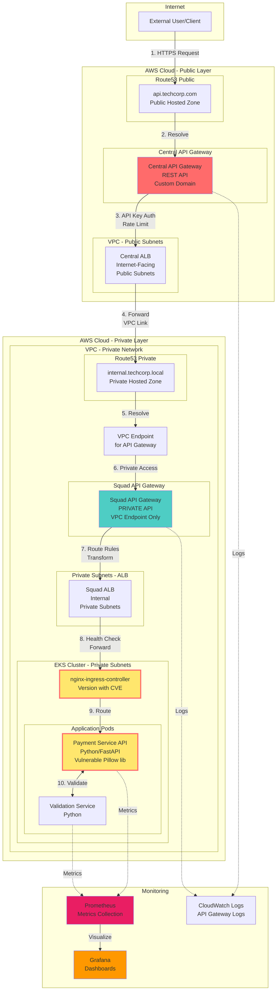
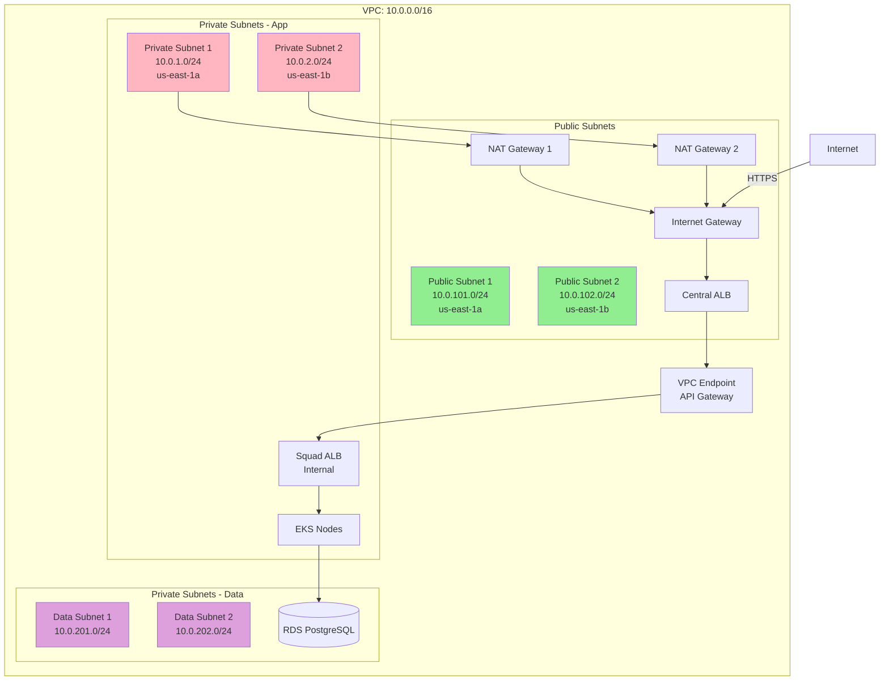
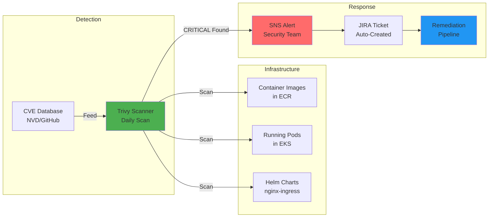

# Project 2: Multi-Tier API Architecture with CVE Response

**Difficulty:** Advanced  
**Time Estimate:** 8-10 hours  
**Cost:** <$100/month (destroy resources between testing)

---

## Table of Contents
- [Overview](#overview)
- [Architecture](#architecture)
- [Requirements](#requirements)
- [Solution](#solution)
- [CVE Response Workflow](#cve-response-workflow)
- [Testing](#testing)
- [Evaluation](#evaluation)

---

## Overview

### Business Context
You work at TechCorp in the Payments Squad. The company uses enterprise-grade multi-tier API architecture:
- **Central Platform Team** manages company-wide API Gateway (authentication, rate limiting, logging)
- **Your Squad** runs internal API Gateway for service-specific routing
- **Your K8s cluster** hosts payment processing microservices

A critical CVE has been detected in your infrastructure and you need to demonstrate detection and remediation.

### Learning Objectives
- Complex enterprise networking (VPC, subnets, security groups)
- Multi-tier API Gateway architecture (public + private)
- Private Route53 for internal service discovery
- VPC Links and VPC Endpoints
- CVE detection and remediation workflows
- Request tracing through multiple network tiers

---

## Architecture

### Complete Request Flow



### Network Architecture



### CVE Detection Flow



---

## Requirements

### Infrastructure Requirements

#### 1. VPC Architecture
- [ ] VPC with CIDR 10.0.0.0/16
- [ ] 2 Public subnets (for NAT, ALB) across 2 AZs
- [ ] 2 Private subnets (for EKS, internal ALB) across 2 AZs
- [ ] 2 Database subnets (for RDS) across 2 AZs
- [ ] Internet Gateway attached to VPC
- [ ] 2 NAT Gateways (one per AZ for HA)
- [ ] Proper route tables configured

#### 2. Central API Gateway (Platform Team)
- [ ] REST API Gateway with custom domain
- [ ] API key authentication
- [ ] Request/response logging to CloudWatch
- [ ] Integration with Central ALB via VPC Link
- [ ] Rate limiting (100 req/sec)
- [ ] CORS configuration

#### 3. Central ALB
- [ ] Internet-facing ALB in public subnets
- [ ] HTTPS listener (port 443)
- [ ] Target group pointing to VPC endpoint
- [ ] Health checks configured
- [ ] Access logs to S3

#### 4. Private Route53
- [ ] Private Hosted Zone: `internal.techcorp.local`
- [ ] A record pointing to Squad API Gateway VPC endpoint
- [ ] Associated with VPC

#### 5. Squad API Gateway (Your Team)
- [ ] PRIVATE REST API (not publicly accessible)
- [ ] VPC Endpoint required for access
- [ ] Resource policy restricting access to your VPC
- [ ] Custom domain using Private Route53
- [ ] Integration with Squad ALB via VPC Link
- [ ] Request transformation (add headers)

#### 6. Squad ALB
- [ ] Internal ALB in private subnets
- [ ] Target group pointing to EKS worker nodes
- [ ] Health checks to nginx-ingress
- [ ] Deregistration delay: 30 seconds

#### 7. EKS Cluster
- [ ] Control plane in AWS-managed VPC
- [ ] Worker nodes in private subnets
- [ ] Node group: 2-4 t3.medium instances
- [ ] nginx-ingress-controller deployed (use v1.2.0 for CVE simulation)
- [ ] IRSA configured for service accounts

#### 8. Application Services
- [ ] Payment API (Python/FastAPI)
- [ ] Validation Service (Python)
- [ ] Both services expose Prometheus metrics
- [ ] Health check endpoints

### Security Requirements

#### CVE Scenarios to Address

**CVE-1: nginx-ingress-controller**
- Vulnerable version: 1.2.0
- Issue: HTTP request smuggling
- Fix: Upgrade to 1.9.0+

**CVE-2: Python Pillow Library**
- Vulnerable: Pillow < 10.0.0
- Issue: Remote Code Execution
- Fix: Update base image, upgrade Pillow

### Monitoring Requirements

- [ ] CloudWatch Logs for both API Gateways
- [ ] Prometheus scraping pod metrics
- [ ] Grafana dashboard showing:
  - Request latency at each hop
  - Error rates per service
  - CVE scan results
- [ ] Alert on detection of CRITICAL CVEs

---

## Solution

### Directory Structure

```
multi-tier-api/
├── README.md
├── docs/
│   ├── architecture-detailed.md
│   ├── network-design.md
│   ├── cve-response-runbook.md
│   └── request-flow-tracing.md
├── terraform/
│   ├── main.tf
│   ├── variables.tf
│   ├── outputs.tf
│   ├── vpc.tf
│   ├── central-apigw.tf
│   ├── central-alb.tf
│   ├── private-route53.tf
│   ├── squad-apigw.tf
│   ├── squad-alb.tf
│   ├── eks.tf
│   ├── rds.tf
│   ├── iam.tf
│   └── security-groups.tf
├── kubernetes/
│   ├── nginx-ingress/
│   │   └── values.yaml
│   ├── payment-api/
│   │   ├── deployment.yaml
│   │   ├── service.yaml
│   │   └── ingress.yaml
│   ├── validation-svc/
│   │   ├── deployment.yaml
│   │   └── service.yaml
│   └── monitoring/
│       ├── prometheus.yaml
│       └── grafana.yaml
├── applications/
│   ├── payment-api/
│   │   ├── Dockerfile
│   │   ├── app.py
│   │   └── requirements.txt
│   └── validation-svc/
│       ├── Dockerfile
│       ├── app.py
│       └── requirements.txt
├── scripts/
│   ├── scan-infrastructure.sh
│   ├── patch-nginx-ingress.sh
│   ├── rebuild-images.sh
│   └── test-request-flow.sh
└── .github/workflows/
    ├── cve-scan.yml
    └── deploy.yml
```

### Terraform Infrastructure

#### terraform/vpc.tf
```hcl
module "vpc" {
  source  = "terraform-aws-modules/vpc/aws"
  version = "~> 5.0"

  name = "techcorp-payments-vpc"
  cidr = "10.0.0.0/16"

  azs              = ["us-east-1a", "us-east-1b"]
  private_subnets  = ["10.0.1.0/24", "10.0.2.0/24"]
  public_subnets   = ["10.0.101.0/24", "10.0.102.0/24"]
  database_subnets = ["10.0.201.0/24", "10.0.202.0/24"]

  enable_nat_gateway   = true
  single_nat_gateway   = false  # One NAT per AZ for HA
  enable_dns_hostnames = true
  enable_dns_support   = true

  # For EKS
  enable_flow_log                      = true
  create_flow_log_cloudwatch_iam_role  = true
  create_flow_log_cloudwatch_log_group = true

  public_subnet_tags = {
    "kubernetes.io/role/elb" = "1"
  }

  private_subnet_tags = {
    "kubernetes.io/role/internal-elb" = "1"
  }

  tags = {
    Environment = "production"
    Squad       = "payments"
  }
}
```

#### terraform/central-apigw.tf
```hcl
# VPC Link for Central API Gateway → Central ALB
resource "aws_api_gateway_vpc_link" "central" {
  name        = "central-apigw-vpc-link"
  target_arns = [aws_lb.central.arn]

  tags = {
    Name = "central-apigw-vpc-link"
  }
}

# Central API Gateway REST API
resource "aws_api_gateway_rest_api" "central" {
  name        = "central-platform-api"
  description = "Central API Gateway for all squads"

  endpoint_configuration {
    types = ["REGIONAL"]
  }

  tags = {
    Team = "platform"
  }
}

# Resource: /payments
resource "aws_api_gateway_resource" "payments" {
  rest_api_id = aws_api_gateway_rest_api.central.id
  parent_id   = aws_api_gateway_rest_api.central.root_resource_id
  path_part   = "payments"
}

# Method: ANY /payments/{proxy+}
resource "aws_api_gateway_resource" "payments_proxy" {
  rest_api_id = aws_api_gateway_rest_api.central.id
  parent_id   = aws_api_gateway_resource.payments.id
  path_part   = "{proxy+}"
}

resource "aws_api_gateway_method" "payments_proxy" {
  rest_api_id   = aws_api_gateway_rest_api.central.id
  resource_id   = aws_api_gateway_resource.payments_proxy.id
  http_method   = "ANY"
  authorization = "NONE"
  
  api_key_required = true
  
  request_parameters = {
    "method.request.path.proxy" = true
  }
}

# Integration: Central ALB via VPC Link
resource "aws_api_gateway_integration" "payments_proxy" {
  rest_api_id = aws_api_gateway_rest_api.central.id
  resource_id = aws_api_gateway_resource.payments_proxy.id
  http_method = aws_api_gateway_method.payments_proxy.http_method

  type                    = "HTTP_PROXY"
  integration_http_method = "ANY"
  uri                     = "http://internal.techcorp.local/payments/{proxy}"
  connection_type         = "VPC_LINK"
  connection_id           = aws_api_gateway_vpc_link.central.id

  request_parameters = {
    "integration.request.path.proxy" = "method.request.path.proxy"
  }
}

# Deployment
resource "aws_api_gateway_deployment" "central" {
  rest_api_id = aws_api_gateway_rest_api.central.id

  triggers = {
    redeployment = sha1(jsonencode([
      aws_api_gateway_resource.payments_proxy.id,
      aws_api_gateway_method.payments_proxy.id,
      aws_api_gateway_integration.payments_proxy.id,
    ]))
  }

  lifecycle {
    create_before_destroy = true
  }

  depends_on = [
    aws_api_gateway_integration.payments_proxy
  ]
}

# Stage
resource "aws_api_gateway_stage" "central_prod" {
  deployment_id = aws_api_gateway_deployment.central.id
  rest_api_id   = aws_api_gateway_rest_api.central.id
  stage_name    = "prod"

  # Enable logging
  access_log_settings {
    destination_arn = aws_cloudwatch_log_group.central_apigw.arn
    format = jsonencode({
      requestId      = "$context.requestId"
      ip             = "$context.identity.sourceIp"
      requestTime    = "$context.requestTime"
      httpMethod     = "$context.httpMethod"
      resourcePath   = "$context.resourcePath"
      status         = "$context.status"
      protocol       = "$context.protocol"
      responseLength = "$context.responseLength"
    })
  }

  # Throttling
  throttle_settings {
    rate_limit  = 100
    burst_limit = 200
  }
}

# CloudWatch Log Group
resource "aws_cloudwatch_log_group" "central_apigw" {
  name              = "/aws/apigateway/central"
  retention_in_days = 7
}

# API Key
resource "aws_api_gateway_api_key" "payments_squad" {
  name = "payments-squad-key"
  enabled = true
}

# Usage Plan
resource "aws_api_gateway_usage_plan" "central" {
  name = "central-api-usage-plan"

  api_stages {
    api_id = aws_api_gateway_rest_api.central.id
    stage  = aws_api_gateway_stage.central_prod.stage_name
  }

  throttle_settings {
    rate_limit  = 100
    burst_limit = 200
  }
}

# Link API Key to Usage Plan
resource "aws_api_gateway_usage_plan_key" "main" {
  key_id        = aws_api_gateway_api_key.payments_squad.id
  key_type      = "API_KEY"
  usage_plan_id = aws_api_gateway_usage_plan.central.id
}
```

#### terraform/central-alb.tf
```hcl
resource "aws_lb" "central" {
  name               = "central-alb"
  internal           = false
  load_balancer_type = "application"
  security_groups    = [aws_security_group.central_alb.id]
  subnets            = module.vpc.public_subnets

  enable_deletion_protection = false
  enable_http2              = true

  access_logs {
    bucket  = aws_s3_bucket.alb_logs.id
    prefix  = "central-alb"
    enabled = true
  }

  tags = {
    Name = "central-alb"
  }
}

# Target Group pointing to Private Route53/VPC Endpoint
resource "aws_lb_target_group" "central_to_private" {
  name     = "central-to-private-dns"
  port     = 443
  protocol = "HTTPS"
  vpc_id   = module.vpc.vpc_id

  health_check {
    enabled             = true
    healthy_threshold   = 2
    interval            = 30
    matcher             = "200-399"
    path                = "/health"
    port                = "traffic-port"
    protocol            = "HTTPS"
    timeout             = 5
    unhealthy_threshold = 2
  }

  deregistration_delay = 30

  tags = {
    Name = "central-to-private-dns-tg"
  }
}

# Listener
resource "aws_lb_listener" "central_https" {
  load_balancer_arn = aws_lb.central.arn
  port              = "443"
  protocol          = "HTTPS"
  ssl_policy        = "ELBSecurityPolicy-TLS-1-2-2017-01"
  certificate_arn   = aws_acm_certificate.central.arn

  default_action {
    type             = "forward"
    target_group_arn = aws_lb_target_group.central_to_private.arn
  }
}

# Security Group
resource "aws_security_group" "central_alb" {
  name_prefix = "central-alb-"
  vpc_id      = module.vpc.vpc_id

  ingress {
    from_port   = 443
    to_port     = 443
    protocol    = "tcp"
    cidr_blocks = ["0.0.0.0/0"]
    description = "HTTPS from internet"
  }

  ingress {
    from_port   = 80
    to_port     = 80
    protocol    = "tcp"
    cidr_blocks = ["0.0.0.0/0"]
    description = "HTTP from internet"
  }

  egress {
    from_port   = 0
    to_port     = 0
    protocol    = "-1"
    cidr_blocks = ["0.0.0.0/0"]
  }

  tags = {
    Name = "central-alb-sg"
  }
}

# S3 Bucket for ALB Logs
resource "aws_s3_bucket" "alb_logs" {
  bucket = "techcorp-alb-logs-${data.aws_caller_identity.current.account_id}"

  tags = {
    Name = "alb-logs"
  }
}

resource "aws_s3_bucket_lifecycle_configuration" "alb_logs" {
  bucket = aws_s3_bucket.alb_logs.id

  rule {
    id     = "delete-old-logs"
    status = "Enabled"

    expiration {
      days = 30
    }
  }
}

data "aws_caller_identity" "current" {}
```

#### terraform/private-route53.tf
```hcl
resource "aws_route53_zone" "private" {
  name = "internal.techcorp.local"

  vpc {
    vpc_id = module.vpc.vpc_id
  }

  tags = {
    Name = "private-hosted-zone"
  }
}

# A record pointing to Squad API Gateway VPC Endpoint
resource "aws_route53_record" "squad_api" {
  zone_id = aws_route53_zone.private.zone_id
  name    = "api.internal.techcorp.local"
  type    = "A"

  alias {
    name                   = aws_vpc_endpoint.squad_apigw.dns_entry[0].dns_name
    zone_id                = aws_vpc_endpoint.squad_apigw.dns_entry[0].hosted_zone_id
    evaluate_target_health = true
  }
}
```

#### terraform/squad-apigw.tf
```hcl
# VPC Endpoint for Private API Gateway
resource "aws_vpc_endpoint" "squad_apigw" {
  vpc_id              = module.vpc.vpc_id
  service_name        = "com.amazonaws.${var.aws_region}.execute-api"
  vpc_endpoint_type   = "Interface"
  private_dns_enabled = true

  subnet_ids = module.vpc.private_subnets
  security_group_ids = [aws_security_group.squad_apigw_endpoint.id]

  tags = {
    Name = "squad-apigw-endpoint"
  }
}

resource "aws_security_group" "squad_apigw_endpoint" {
  name_prefix = "squad-apigw-endpoint-"
  vpc_id      = module.vpc.vpc_id

  ingress {
    from_port       = 443
    to_port         = 443
    protocol        = "tcp"
    security_groups = [aws_security_group.central_alb.id]
    description     = "HTTPS from Central ALB"
  }

  egress {
    from_port   = 0
    to_port     = 0
    protocol    = "-1"
    cidr_blocks = ["0.0.0.0/0"]
  }

  tags = {
    Name = "squad-apigw-endpoint-sg"
  }
}

# VPC Link for Squad API Gateway → Squad ALB
resource "aws_api_gateway_vpc_link" "squad" {
  name        = "squad-apigw-vpc-link"
  target_arns = [aws_lb.squad.arn]

  tags = {
    Name = "squad-apigw-vpc-link"
  }
}

# Squad API Gateway PRIVATE REST API
resource "aws_api_gateway_rest_api" "squad" {
  name        = "payments-squad-api"
  description = "Payments Squad Internal API"

  endpoint_configuration {
    types            = ["PRIVATE"]
    vpc_endpoint_ids = [aws_vpc_endpoint.squad_apigw.id]
  }

  policy = jsonencode({
    Version = "2012-10-17"
    Statement = [
      {
        Effect = "Allow"
        Principal = "*"
        Action = "execute-api:Invoke"
        Resource = "*"
        Condition = {
          StringEquals = {
            "aws:SourceVpc" = module.vpc.vpc_id
          }
        }
      }
    ]
  })

  tags = {
    Squad = "payments"
  }
}

# Root resource proxy
resource "aws_api_gateway_resource" "squad_proxy" {
  rest_api_id = aws_api_gateway_rest_api.squad.id
  parent_id   = aws_api_gateway_rest_api.squad.root_resource_id
  path_part   = "{proxy+}"
}

resource "aws_api_gateway_method" "squad_proxy" {
  rest_api_id   = aws_api_gateway_rest_api.squad.id
  resource_id   = aws_api_gateway_resource.squad_proxy.id
  http_method   = "ANY"
  authorization = "NONE"

  request_parameters = {
    "method.request.path.proxy" = true
  }
}

# Integration with Squad ALB
resource "aws_api_gateway_integration" "squad_proxy" {
  rest_api_id = aws_api_gateway_rest_api.squad.id
  resource_id = aws_api_gateway_resource.squad_proxy.id
  http_method = aws_api_gateway_method.squad_proxy.http_method

  type                    = "HTTP_PROXY"
  integration_http_method = "ANY"
  uri                     = "http://${aws_lb.squad.dns_name}/{proxy}"
  connection_type         = "VPC_LINK"
  connection_id           = aws_api_gateway_vpc_link.squad.id

  request_parameters = {
    "integration.request.path.proxy"          = "method.request.path.proxy"
    "integration.request.header.X-Squad-ID"   = "'payments'"
    "integration.request.header.X-Request-ID" = "context.requestId"
  }
}

# Deployment
resource "aws_api_gateway_deployment" "squad" {
  rest_api_id = aws_api_gateway_rest_api.squad.id

  triggers = {
    redeployment = sha1(jsonencode([
      aws_api_gateway_resource.squad_proxy.id,
      aws_api_gateway_method.squad_proxy.id,
      aws_api_gateway_integration.squad_proxy.id,
    ]))
  }

  lifecycle {
    create_before_destroy = true
  }

  depends_on = [
    aws_api_gateway_integration.squad_proxy
  ]
}

# Stage
resource "aws_api_gateway_stage" "squad_prod" {
  deployment_id = aws_api_gateway_deployment.squad.id
  rest_api_id   = aws_api_gateway_rest_api.squad.id
  stage_name    = "prod"

  access_log_settings {
    destination_arn = aws_cloudwatch_log_group.squad_apigw.arn
    format = jsonencode({
      requestId    = "$context.requestId"
      ip           = "$context.identity.sourceIp"
      requestTime  = "$context.requestTime"
      httpMethod   = "$context.httpMethod"
      resourcePath = "$context.resourcePath"
      status       = "$context.status"
    })
  }
}

resource "aws_cloudwatch_log_group" "squad_apigw" {
  name              = "/aws/apigateway/squad-payments"
  retention_in_days = 7
}
```

#### terraform/squad-alb.tf
```hcl
resource "aws_lb" "squad" {
  name               = "squad-payments-alb"
  internal           = true
  load_balancer_type = "application"
  security_groups    = [aws_security_group.squad_alb.id]
  subnets            = module.vpc.private_subnets

  enable_deletion_protection = false

  tags = {
    Name  = "squad-payments-alb"
    Squad = "payments"
  }
}

# Target Group pointing to EKS worker nodes
resource "aws_lb_target_group" "squad_eks" {
  name     = "squad-to-eks-nodes"
  port     = 30080  # NodePort for nginx-ingress
  protocol = "HTTP"
  vpc_id   = module.vpc.vpc_id

  health_check {
    enabled             = true
    healthy_threshold   = 2
    interval            = 30
    matcher             = "200"
    path                = "/healthz"
    port                = "30080"
    protocol            = "HTTP"
    timeout             = 5
    unhealthy_threshold = 2
  }

  deregistration_delay = 30

  tags = {
    Name = "squad-to-eks-tg"
  }
}

# Register EKS nodes as targets
resource "aws_lb_target_group_attachment" "eks_nodes" {
  for_each = toset(data.aws_instances.eks_nodes.ids)

  target_group_arn = aws_lb_target_group.squad_eks.arn
  target_id        = each.value
  port             = 30080
}

data "aws_instances" "eks_nodes" {
  filter {
    name   = "tag:kubernetes.io/cluster/${module.eks.cluster_name}"
    values = ["owned"]
  }

  instance_state_names = ["running"]

  depends_on = [module.eks]
}

# Listener
resource "aws_lb_listener" "squad_http" {
  load_balancer_arn = aws_lb.squad.arn
  port              = "80"
  protocol          = "HTTP"

  default_action {
    type             = "forward"
    target_group_arn = aws_lb_target_group.squad_eks.arn
  }
}

# Security Group
resource "aws_security_group" "squad_alb" {
  name_prefix = "squad-alb-"
  vpc_id      = module.vpc.vpc_id

  ingress {
    from_port       = 80
    to_port         = 80
    protocol        = "tcp"
    security_groups = [aws_security_group.squad_apigw_endpoint.id]
    description     = "HTTP from Squad API Gateway"
  }

  egress {
    from_port   = 0
    to_port     = 0
    protocol    = "-1"
    cidr_blocks = ["0.0.0.0/0"]
  }

  tags = {
    Name = "squad-alb-sg"
  }
}
```

---

## CVE Response Workflow

### Detection Script

#### scripts/scan-infrastructure.sh
```bash
#!/bin/bash
set -e

echo "=== CVE Infrastructure Scan ==="
echo "Date: $(date)"

# Scan ECR images
echo ""
echo "1. Scanning ECR Container Images..."
for repo in payment-api validation-svc; do
    echo "  Scanning $repo..."
    IMAGE_URI=$(aws ecr describe-images \
        --repository-name $repo \
        --query 'sort_by(imageDetails,&imagePushedAt)[-1].imageTags[0]' \
        --output text)
    
    trivy image \
        --severity CRITICAL,HIGH \
        --format json \
        --output /tmp/${repo}-scan.json \
        ${AWS_ACCOUNT_ID}.dkr.ecr.${AWS_REGION}.amazonaws.com/${repo}:${IMAGE_URI}
    
    CRITICAL=$(jq '[.Results[].Vulnerabilities[] | select(.Severity=="CRITICAL")] | length' /tmp/${repo}-scan.json)
    HIGH=$(jq '[.Results[].Vulnerabilities[] | select(.Severity=="HIGH")] | length' /tmp/${repo}-scan.json)
    
    echo "    CRITICAL: $CRITICAL, HIGH: $HIGH"
    
    if [ "$CRITICAL" -gt 0 ]; then
        echo "    ⚠️  CRITICAL vulnerabilities found in $repo"
    fi
done

# Scan running pods
echo ""
echo "2. Scanning Running Kubernetes Pods..."
kubectl get pods -A -o json | \
    jq -r '.items[] | select(.status.phase=="Running") | "\(.metadata.namespace)/\(.metadata.name) \(.spec.containers[0].image)"' | \
    while read pod image; do
        echo "  Scanning $pod..."
        trivy image --severity CRITICAL,HIGH $image
    done

# Check nginx-ingress version
echo ""
echo "3. Checking nginx-ingress-controller version..."
NGINX_VERSION=$(kubectl get deployment -n ingress-nginx ingress-nginx-controller \
    -o jsonencode='{ .spec.template.spec.containers[0].image}' | \
    sed 's/.*://g')

echo "  Current version: $NGINX_VERSION"

if [[ "$NGINX_VERSION" < "1.3.0" ]]; then
    echo "  ⚠️  VULNERABLE: nginx-ingress < 1.3.0 (CVE-2023-XXXXX)"
    echo "  Action required: Upgrade to 1.9.0+"
fi

# Generate report
echo ""
echo "4. Generating consolidated report..."
cat > /tmp/cve-scan-report.json << EOF
{
  "scan_date": "$(date -u +%Y-%m-%dT%H:%M:%SZ)",
  "images_scanned": ["payment-api", "validation-svc"],
  "pods_scanned": $(kubectl get pods -A --no-headers | wc -l),
  "critical_cves": {
    "payment_api": $(jq '[.Results[].Vulnerabilities[] | select(.Severity=="CRITICAL")] | length' /tmp/payment-api-scan.json 2>/dev/null || echo 0),
    "validation_svc": $(jq '[.Results[].Vulnerabilities[] | select(.Severity=="CRITICAL")] | length' /tmp/validation-svc-scan.json 2>/dev/null || echo 0)
  }
}
EOF

echo "Report saved to /tmp/cve-scan-report.json"
cat /tmp/cve-scan-report.json | jq '.'

# Upload to S3
aws s3 cp /tmp/cve-scan-report.json \
    s3://techcorp-security-reports/cve-scans/$(date +%Y%m%d-%H%M%S).json

echo ""
echo "=== Scan Complete ==="
```

### Remediation Scripts

#### scripts/patch-nginx-ingress.sh
```bash
#!/bin/bash
set -e

echo "=== Patching nginx-ingress-controller ==="

CURRENT_VERSION=$(helm list -n ingress-nginx -o json | jq -r '.[0].app_version')
TARGET_VERSION="1.9.5"

echo "Current version: $CURRENT_VERSION"
echo "Target version: $TARGET_VERSION"

if [[ "$CURRENT_VERSION" == "$TARGET_VERSION" ]]; then
    echo "Already on target version. Exiting."
    exit 0
fi

# Backup current configuration
echo "Backing up current configuration..."
kubectl get deployment -n ingress-nginx ingress-nginx-controller -o yaml > /tmp/nginx-ingress-backup.yaml

# Update Helm chart
echo "Updating Helm chart..."
helm repo update

# Upgrade with zero downtime
echo "Performing rolling upgrade..."
helm upgrade ingress-nginx ingress-nginx/ingress-nginx \
    --namespace ingress-nginx \
    --version 4.8.3 \
    --set controller.image.tag=v${TARGET_VERSION} \
    --set controller.replicaCount=2 \
    --set controller.minAvailable=1 \
    --wait \
    --timeout 10m

# Verify upgrade
echo "Verifying upgrade..."
kubectl rollout status deployment/ingress-nginx-controller -n ingress-nginx

NEW_VERSION=$(kubectl get deployment -n ingress-nginx ingress-nginx-controller \
    -o jsonpath='{.spec.template.spec.containers[0].image}' | \
    sed 's/.*://g')

if [[ "$NEW_VERSION" == "v$TARGET_VERSION" ]]; then
    echo "✅ Successfully upgraded to $TARGET_VERSION"
    
    # Rescan
    echo "Rescanning for CVEs..."
    trivy image --severity CRITICAL,HIGH \
        registry.k8s.io/ingress-nginx/controller:v${TARGET_VERSION}
else
    echo "❌ Upgrade verification failed"
    echo "Rolling back..."
    helm rollback ingress-nginx -n ingress-nginx
    exit 1
fi

echo "=== Patch Complete ==="
```

#### scripts/rebuild-images.sh
```bash
#!/bin/bash
set -e

echo "=== Rebuilding Container Images with Patches ==="

# Update base images in Dockerfiles
echo "1. Updating Dockerfiles..."

# Payment API
cat > applications/payment-api/Dockerfile << 'EOF'
FROM python:3.11-slim

WORKDIR /app

# Update system packages
RUN apt-get update && \
    apt-get upgrade -y && \
    apt-get clean && \
    rm -rf /var/lib/apt/lists/*

COPY requirements.txt .

# Install Python packages with updated Pillow
RUN pip install --no-cache-dir --upgrade pip && \
    pip install --no-cache-dir -r requirements.txt && \
    pip install --no-cache-dir --upgrade Pillow==10.1.0

COPY . .

RUN useradd -m -u 1000 appuser && chown -R appuser:appuser /app
USER appuser

EXPOSE 8000

CMD ["uvicorn", "app:app", "--host", "0.0.0.0", "--port", "8000"]
EOF

# Build and push
echo "2. Building new images..."
AWS_ACCOUNT_ID=$(aws sts get-caller-identity --query Account --output text)
AWS_REGION="us-east-1"

for app in payment-api validation-svc; do
    echo "  Building $app..."
    cd applications/$app
    
    docker build -t ${app}:patched .
    docker tag ${app}:patched \
        ${AWS_ACCOUNT_ID}.dkr.ecr.${AWS_REGION}.amazonaws.com/${app}:$(date +%Y%m%d-%H%M%S)
    docker tag ${app}:patched \
        ${AWS_ACCOUNT_ID}.dkr.ecr.${AWS_REGION}.amazonaws.com/${app}:latest
    
    echo "  Scanning $app for CVEs..."
    trivy image --severity CRITICAL,HIGH ${app}:patched
    
    CRITICAL_COUNT=$(trivy image --severity CRITICAL --format json ${app}:patched | \
        jq '[.Results[].Vulnerabilities[] | select(.Severity=="CRITICAL")] | length')
    
    if [ "$CRITICAL_COUNT" -gt 0 ]; then
        echo "  ❌ CRITICAL CVEs still present in $app. Aborting push."
        exit 1
    fi
    
    echo "  ✅ No CRITICAL CVEs found. Pushing to ECR..."
    docker push ${AWS_ACCOUNT_ID}.dkr.ecr.${AWS_REGION}.amazonaws.com/${app}:$(date +%Y%m%d-%H%M%S)
    docker push ${AWS_ACCOUNT_ID}.dkr.ecr.${AWS_REGION}.amazonaws.com/${app}:latest
    
    cd ../..
done

# Trigger deployment
echo "3. Triggering Kubernetes deployment..."
kubectl rollout restart deployment/payment-api -n default
kubectl rollout restart deployment/validation-svc -n default

kubectl rollout status deployment/payment-api -n default
kubectl rollout status deployment/validation-svc -n default

echo "=== Rebuild Complete ==="
```

### CVE Response Runbook

#### docs/cve-response-runbook.md
```markdown
# CVE Response Runbook

## Overview
This runbook guides the response to critical CVE discoveries in our infrastructure.

## Severity Levels

| Level | Response Time | Action |
|-------|---------------|--------|
| CRITICAL | Immediate (< 4 hours) | Emergency patch, all hands |
| HIGH | Same day (< 8 hours) | Scheduled patch, squad team |
| MEDIUM | Within 1 week | Normal sprint planning |
| LOW | Within 1 month | Backlog prioritization |

## Response Workflow

### Phase 1: Detection (0-15 minutes)
1. **Automated Scan** detects CVE
2. **SNS Alert** sent to security team
3. **JIRA Ticket** auto-created
4. **Slack Notification** to #security channel

### Phase 2: Assessment (15-60 minutes)
1. **Identify Affected Components**
   ```bash
   ./scripts/scan-infrastructure.sh
   ```
2. **Determine Severity**
   - CRITICAL: RCE, privilege escalation, data exposure
   - HIGH: Authentication bypass, significant DoS
3. **Check Exploitation Status**
   - Is it being actively exploited?
   - Are there public exploits?

### Phase 3: Planning (1-2 hours)
1. **Review Available Patches**
   - Upstream fix available?
   - Workaround possible?
2. **Test in Dev Environment**
   ```bash
   # Create isolated test cluster
   terraform workspace select dev
   terraform apply
   
   # Apply patch
   ./scripts/patch-nginx-ingress.sh
   
   # Run tests
   ./scripts/test-request-flow.sh
   ```
3. **Create Rollback Plan**
   - Helm rollback procedure
   - Image rollback tags
   - Database backup (if needed)

### Phase 4: Execution (2-4 hours)

#### For nginx-ingress CVE:
```bash
# 1. Patch nginx-ingress
./scripts/patch-nginx-ingress.sh

# 2. Verify no traffic disruption
kubectl get pods -n ingress-nginx -w

# 3. Rescan
trivy image registry.k8s.io/ingress-nginx/controller:v1.9.5
```

#### For Application Image CVEs:
```bash
# 1. Rebuild images with patches
./scripts/rebuild-images.sh

# 2. Rolling deployment
kubectl rollout restart deployment/payment-api
kubectl rollout status deployment/payment-api

# 3. Monitor for errors
kubectl logs -f deployment/payment-api | grep ERROR
```

### Phase 5: Verification (30 minutes)
1. **Rescan Infrastructure**
   ```bash
   ./scripts/scan-infrastructure.sh
   ```
2. **Verify CVE Resolved**
   - Check scan reports
   - Confirm vulnerable version no longer running
3. **Test Request Flow**
   ```bash
   ./scripts/test-request-flow.sh
   ```

### Phase 6: Post-Incident (1-2 days)
1. **Update Documentation**
   - Record what was patched
   - Update version inventory
2. **Root Cause Analysis**
   - Why wasn't it caught earlier?
   - How to prevent similar issues?
3. **Process Improvements**
   - Update scanning frequency?
   - Add pre-deployment CVE gates?

## Emergency Contacts

| Role | Contact | Escalation Time |
|------|---------|-----------------|
| On-Call DevOps | PagerDuty | Immediate |
| Security Lead | security-lead@techcorp.com | 15 minutes |
| VP Engineering | vp-eng@techcorp.com | 1 hour |

## Rollback Procedures

### Rollback nginx-ingress
```bash
helm rollback ingress-nginx -n ingress-nginx
kubectl rollout status deployment/ingress-nginx-controller -n ingress-nginx
```

### Rollback Application
```bash
# Get previous image tag
kubectl rollout history deployment/payment-api

# Rollback
kubectl rollout undo deployment/payment-api
kubectl rollout status deployment/payment-api
```

## Testing Checklist
- [ ] All pods are running
- [ ] Health checks passing
- [ ] Request flow works end-to-end
- [ ] No increase in error rates
- [ ] Latency within acceptable range
- [ ] CVE no longer detected in scans
```

---

## Testing

### Request Flow Test

#### scripts/test-request-flow.sh
```bash
#!/bin/bash
set -e

echo "=== Testing Complete Request Flow ==="

# Configuration
CENTRAL_API_DOMAIN="api.techcorp.com"
API_KEY="your-api-key-here"

# Test 1: Health check
echo ""
echo "Test 1: Health Check through all layers..."
curl -i -X GET \
  -H "x-api-key: $API_KEY" \
  https://${CENTRAL_API_DOMAIN}/payments/health

# Test 2: Create payment
echo ""
echo "Test 2: Create payment request..."
PAYMENT_ID=$(curl -s -X POST \
  -H "x-api-key: $API_KEY" \
  -H "Content-Type: application/json" \
  -d '{"amount": 100.00, "currency": "USD", "customer_id": "cust_123"}' \
  https://${CENTRAL_API_DOMAIN}/payments/create | \
  jq -r '.payment_id')

echo "Created payment: $PAYMENT_ID"

# Test 3: Get payment status
echo ""
echo "Test 3: Get payment status..."
curl -s -X GET \
  -H "x-api-key: $API_KEY" \
  https://${CENTRAL_API_DOMAIN}/payments/${PAYMENT_ID} | jq '.'

# Test 4: Trace request through logs
echo ""
echo "Test 4: Tracing request through CloudWatch..."
REQUEST_ID=$(aws logs filter-log-events \
  --log-group-name /aws/apigateway/central \
  --filter-pattern "payment" \
  --max-items 1 \
  --query 'events[0].message' \
  --output text | jq -r '.requestId')

echo "Request ID: $REQUEST_ID"

# Check each layer
echo "  - Central API Gateway logs:"
aws logs filter-log-events \
  --log-group-name /aws/apigateway/central \
  --filter-pattern "$REQUEST_ID" | \
  jq '.events[].message'

echo "  - Squad API Gateway logs:"
aws logs filter-log-events \
  --log-group-name /aws/apigateway/squad-payments \
  --filter-pattern "$REQUEST_ID" | \
  jq '.events[].message'

echo "  - Application logs:"
kubectl logs -l app=payment-api --tail=20 | grep "$REQUEST_ID"

echo ""
echo "=== Test Complete ==="
```

---

## Evaluation

### Rubric

| Category | Weight | Criteria |
|----------|--------|----------|
| **Network Architecture** | 25% | VPC, subnets, routing, security groups correct |
| **API Gateway Setup** | 20% | Both gateways configured, VPC Links working |
| **Request Flow** | 20% | Can trace request through all 7 layers |
| **CVE Detection** | 15% | Automated scanning, accurate findings |
| **CVE Remediation** | 15% | Zero-downtime patching, verification |
| **Documentation** | 5% | Clear runbooks, architecture diagrams |

### Testing Checklist
- [ ] Can hit public API Gateway from internet
- [ ] Private API Gateway NOT accessible from internet
- [ ] Request flows: Public DNS → Central APIGW → ALB → Private DNS → Squad APIGW → ALB → K8s
- [ ] Can trace request through CloudWatch logs
- [ ] CVE scanner detects nginx-ingress vulnerability
- [ ] CVE scanner detects Python image vulnerability
- [ ] Can patch nginx-ingress with zero downtime
- [ ] Can rebuild and deploy patched images
- [ ] Post-patch scans show CVEs resolved
- [ ] Grafana dashboard shows metrics from all layers

---

**This is a comprehensive, enterprise-grade project. Good luck! 🚀**
