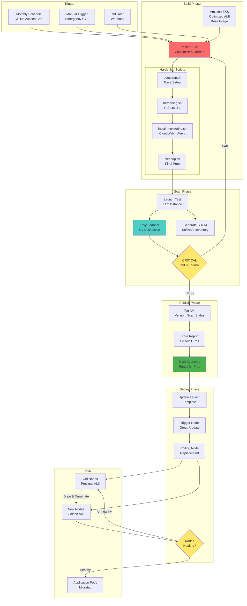
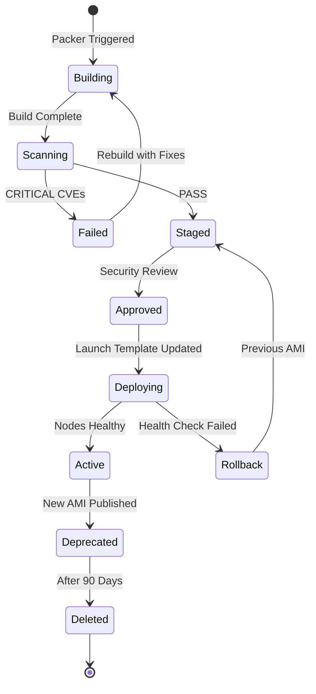
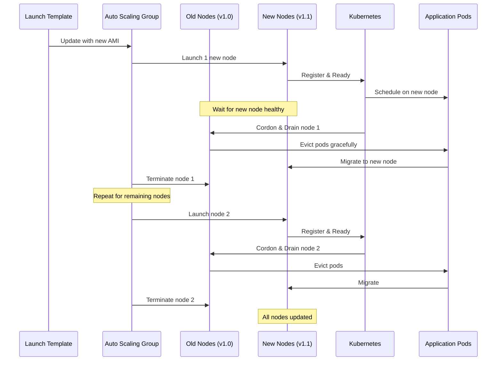

# Project 3: Golden AMI Management Pipeline for EKS

**Difficulty:** Advanced  
**Time Estimate:** 8-12 hours  
**Cost:** <$50/month (destroy EKS cluster when not testing)

---

## Table of Contents
- [Overview](#overview)
- [Architecture](#architecture)
- [Requirements](#requirements)
- [Solution](#solution)
- [CVE Remediation](#cve-remediation)
- [Testing](#testing)
- [Evaluation](#evaluation)

---

## Overview

### Business Context
Your company runs multiple EKS clusters and needs standardized, secure base AMIs for all worker nodes. The security team requires:
- Monthly AMI rebuilds with latest patches
- CVE scanning before AMI publication
- Automated rollout to clusters when new AMIs available
- Complete audit trail

### Learning Objectives
- Immutable infrastructure patterns
- Packer for AMI automation
- Security hardening (CIS benchmarks)
- CVE scanning and remediation
- EKS node lifecycle management
- Launch template and rolling updates

---

## Architecture

### Golden AMI Pipeline Flow



### AMI Lifecycle States



### Rolling Update Strategy



---

## Requirements

### AMI Build Requirements

#### Base Configuration
- [ ] Start from latest Amazon EKS-optimized AMI
- [ ] Amazon Linux 2 (or AL2023)
- [ ] Kubernetes version matching EKS cluster

#### Security Hardening (CIS Level 1)
- [ ] Disable unused services
- [ ] Configure SSH hardening
- [ ] Set file permissions (0600 for sensitive files)
- [ ] Configure kernel parameters
- [ ] Enable auditd for logging
- [ ] Configure firewall rules
- [ ] Disable root login

#### Installed Software
- [ ] CloudWatch Agent
- [ ] SSM Agent (latest)
- [ ] Prometheus Node Exporter
- [ ] fail2ban
- [ ] aide (file integrity)
- [ ] Python 3.11
- [ ] awscli v2
- [ ] kubectl
- [ ] jq, yq

#### Tagging
- [ ] Version number (semantic versioning)
- [ ] Build date
- [ ] Base AMI ID
- [ ] Kubernetes version
- [ ] Scan status
- [ ] Approval status

### Scanning Requirements

- [ ] Use Trivy or Grype
- [ ] Scan for ALL severity levels
- [ ] Generate SBOM (Software Bill of Materials)
- [ ] Fail on CRITICAL CVEs
- [ ] Warn on HIGH CVEs (but continue)
- [ ] Store scan results in S3
- [ ] Retention: 90 days

### EKS Integration Requirements

- [ ] Launch Template with AMI lookup by tags
- [ ] Managed Node Group configuration
- [ ] Rolling update strategy
- [ ] Max unavailable: 1 node
- [ ] Health checks before draining
- [ ] Graceful pod eviction

---

## Solution

### Directory Structure

```
golden-ami-pipeline/
├── README.md
├── docs/
│   ├── architecture.md
│   ├── ami-versioning.md
│   ├── cve-response.md
│   └── hardening-standards.md
├── packer/
│   ├── eks-golden-ami.pkr.hcl
│   ├── variables.pkr.hcl
│   ├── scripts/
│   │   ├── bootstrap.sh
│   │   ├── hardening.sh
│   │   ├── install-monitoring.sh
│   │   └── cleanup.sh
│   └── files/
│       ├── cloudwatch-config.json
│       ├── audit.rules
│       └── sshd_config
├── terraform/
│   ├── main.tf
│   ├── variables.tf
│   ├── outputs.tf
│   ├── eks.tf
│   ├── launch-template.tf
│   ├── node-groups.tf
│   ├── iam.tf
│   └── lambda/
│       └── ami-updater/
│           ├── handler.py
│           └── requirements.txt
├── scripts/
│   ├── build-ami.sh
│   ├── scan-ami.py
│   ├── publish-ami.py
│   ├── update-cluster.sh
│   └── emergency-rebuild.sh
└── .github/
    └── workflows/
        ├── scheduled-build.yml
        ├── manual-build.yml
        └── emergency-cve.yml
```

### Packer Configuration

#### packer/eks-golden-ami.pkr.hcl
```hcl
packer {
  required_plugins {
    amazon = {
      version = ">= 1.2.0"
      source  = "github.com/hashicorp/amazon"
    }
  }
}

# Data source: Latest EKS-optimized AMI
data "amazon-ami" "eks_base" {
  filters = {
    name                = "amazon-eks-node-1.28-*"
    root-device-type    = "ebs"
    virtualization-type = "hvm"
  }
  most_recent = true
  owners      = ["602401143452"] # Amazon EKS AMI account ID
  region      = var.aws_region
}

# Local variables
locals {
  timestamp = regex_replace(timestamp(), "[- TZ:]", "")
  version   = "${var.ami_version_major}.${var.ami_version_minor}.${local.timestamp}"
}

source "amazon-ebs" "eks_golden" {
  # Source AMI
  source_ami    = data.amazon-ami.eks_base.id
  ami_name      = "golden-eks-node-${local.version}"
  ami_description = "Golden AMI for EKS nodes - Version ${local.version}"
  
  # Instance configuration
  instance_type = "t3.medium"
  region        = var.aws_region
  ssh_username  = "ec2-user"
  
  # Networking
  vpc_id    = var.vpc_id
  subnet_id = var.subnet_id
  
  # Security
  associate_public_ip_address = true
  security_group_ids          = [var.security_group_id]
  iam_instance_profile        = var.iam_instance_profile
  
  # AMI configuration
  ami_regions = var.ami_regions
  
  tags = {
    Name              = "golden-eks-node-${local.version}"
    Version           = local.version
    BaseAMI           = data.amazon-ami.eks_base.id
    KubernetesVersion = "1.28"
    BuildDate         = timestamp()
    Builder           = "packer"
    Environment       = var.environment
    CostCenter        = "infrastructure"
  }
  
  run_tags = {
    Name = "packer-builder-golden-ami"
  }
  
  # Snapshot tags
  snapshot_tags = {
    Name    = "golden-eks-node-${local.version}-snapshot"
    Version = local.version
  }
}

build {
  name    = "golden-eks-ami"
  sources = ["source.amazon-ebs.eks_golden"]
  
  # Wait for cloud-init
  provisioner "shell" {
    inline = [
      "echo 'Waiting for cloud-init to complete...'",
      "cloud-init status --wait",
      "echo 'Cloud-init complete'"
    ]
  }
  
  # Bootstrap
  provisioner "shell" {
    script = "${path.root}/scripts/bootstrap.sh"
    environment_vars = [
      "AWS_REGION=${var.aws_region}",
      "ENVIRONMENT=${var.environment}"
    ]
  }
  
  # Security hardening
  provisioner "shell" {
    script          = "${path.root}/scripts/hardening.sh"
    execute_command = "sudo -S sh -c '{{ .Vars }} {{ .Path }}'"
  }
  
  # Install monitoring tools
  provisioner "file" {
    source      = "${path.root}/files/cloudwatch-config.json"
    destination = "/tmp/cloudwatch-config.json"
  }
  
  provisioner "file" {
    source      = "${path.root}/files/audit.rules"
    destination = "/tmp/audit.rules"
  }
  
  provisioner "shell" {
    script          = "${path.root}/scripts/install-monitoring.sh"
    execute_command = "sudo -S sh -c '{{ .Vars }} {{ .Path }}'"
  }
  
  # Cleanup
  provisioner "shell" {
    script          = "${path.root}/scripts/cleanup.sh"
    execute_command = "sudo -S sh -c '{{ .Vars }} {{ .Path }}'"
  }
  
  # Validate
  provisioner "shell" {
    inline = [
      "echo 'Validating AMI...'",
      "test -f /usr/bin/kubectl || exit 1",
      "test -f /opt/aws/amazon-cloudwatch-agent/bin/amazon-cloudwatch-agent || exit 1",
      "systemctl is-enabled auditd || exit 1",
      "echo 'Validation successful'"
    ]
  }
  
  # Post-processor: Manifest
  post-processor "manifest" {
    output     = "manifest.json"
    strip_path = true
    custom_data = {
      version           = local.version
      base_ami_id       = data.amazon-ami.eks_base.id
      kubernetes_version = "1.28"
    }
  }
}
```

#### packer/variables.pkr.hcl
```hcl
variable "aws_region" {
  type    = string
  default = "us-east-1"
}

variable "ami_version_major" {
  type    = string
  default = "1"
}

variable "ami_version_minor" {
  type    = string
  default = "0"
}

variable "vpc_id" {
  type        = string
  description = "VPC ID for Packer builder"
}

variable "subnet_id" {
  type        = string
  description = "Subnet ID for Packer builder"
}

variable "security_group_id" {
  type        = string
  description = "Security group for Packer builder"
}

variable "iam_instance_profile" {
  type        = string
  description = "IAM instance profile for Packer builder"
  default     = ""
}

variable "ami_regions" {
  type        = list(string)
  description = "Regions to copy AMI to"
  default     = ["us-east-1"]
}

variable "environment" {
  type    = string
  default = "production"
}
```

### Hardening Scripts

#### packer/scripts/bootstrap.sh
```bash
#!/bin/bash
set -euo pipefail

echo "=== Bootstrap Script ==="

# Update system packages
echo "Updating system packages..."
sudo yum update -y

# Install essential packages
echo "Installing essential packages..."
sudo yum install -y \
    jq \
    git \
    vim \
    htop \
    wget \
    unzip \
    python3 \
    python3-pip

# Install AWS CLI v2
echo "Installing AWS CLI v2..."
cd /tmp
curl "https://awscli.amazonaws.com/awscli-exe-linux-x86_64.zip" -o "awscliv2.zip"
unzip awscliv2.zip
sudo ./aws/install
rm -rf awscliv2.zip aws/

# Install kubectl (matching EKS version)
echo "Installing kubectl..."
K8S_VERSION="1.28.2"
curl -LO "https://dl.k8s.io/release/v${K8S_VERSION}/bin/linux/amd64/kubectl"
sudo install -o root -g root -m 0755 kubectl /usr/local/bin/kubectl
rm kubectl

# Install Session Manager plugin
echo "Installing SSM plugin..."
sudo yum install -y https://s3.amazonaws.com/session-manager-downloads/plugin/latest/linux_64bit/session-manager-plugin.rpm

# Set timezone
echo "Setting timezone to UTC..."
sudo timedatectl set-timezone UTC

# Configure NTP
echo "Configuring chrony (NTP)..."
sudo yum install -y chrony
sudo systemctl enable chronyd
sudo systemctl start chronyd

echo "=== Bootstrap Complete ==="
```

#### packer/scripts/hardening.sh
```bash
#!/bin/bash
set -euo pipefail

echo "=== Security Hardening Script (CIS Level 1) ==="

# 1. SSH Hardening
echo "Hardening SSH configuration..."
cat > /etc/ssh/sshd_config << 'EOF'
# SSH Hardened Configuration
Port 22
Protocol 2
PermitRootLogin no
PubkeyAuthentication yes
PasswordAuthentication no
PermitEmptyPasswords no
ChallengeResponseAuthentication no
UsePAM yes
X11Forwarding no
PrintMotd no
AcceptEnv LANG LC_*
Subsystem sftp /usr/libexec/openssh/sftp-server
ClientAliveInterval 300
ClientAliveCountMax 0
MaxAuthTries 3
MaxSessions 10
EOF

# 2. Disable unused services
echo "Disabling unused services..."
for service in avahi-daemon cups bluetooth; do
    if systemctl list-unit-files | grep -q $service; then
        systemctl disable $service 2>/dev/null || true
        systemctl stop $service 2>/dev/null || true
    fi
done

# 3. Configure auditd
echo "Configuring auditd..."
yum install -y audit
cp /tmp/audit.rules /etc/audit/rules.d/hardening.rules
systemctl enable auditd
# Note: Don't start auditd during AMI build

# 4. Set file permissions
echo "Setting secure file permissions..."
chmod 600 /etc/ssh/sshd_config
chmod 700 /root
chmod 600 /boot/grub2/grub.cfg 2>/dev/null || true

# 5. Kernel parameters
echo "Configuring kernel parameters..."
cat > /etc/sysctl.d/99-hardening.conf << 'EOF'
# IP forwarding (needed for Kubernetes)
net.ipv4.ip_forward = 1
net.bridge.bridge-nf-call-iptables = 1

# Disable IPv6 if not needed
net.ipv6.conf.all.disable_ipv6 = 1
net.ipv6.conf.default.disable_ipv6 = 1

# Protection against SYN flood attacks
net.ipv4.tcp_syncookies = 1
net.ipv4.tcp_max_syn_backlog = 2048

# Ignore ICMP redirects
net.ipv4.conf.all.accept_redirects = 0
net.ipv4.conf.default.accept_redirects = 0
net.ipv4.conf.all.secure_redirects = 0
net.ipv4.conf.default.secure_redirects = 0

# Do not send ICMP redirects
net.ipv4.conf.all.send_redirects = 0
net.ipv4.conf.default.send_redirects = 0

# Ignore source routed packets
net.ipv4.conf.all.accept_source_route = 0
net.ipv4.conf.default.accept_source_route = 0

# Log suspicious packets
net.ipv4.conf.all.log_martians = 1
net.ipv4.conf.default.log_martians = 1
EOF

# 6. Install and configure fail2ban
echo "Installing fail2ban..."
yum install -y fail2ban
systemctl enable fail2ban

cat > /etc/fail2ban/jail.local << 'EOF'
[DEFAULT]
bantime = 3600
findtime = 600
maxretry = 5

[sshd]
enabled = true
port = ssh
logpath = /var/log/secure
EOF

# 7. Install AIDE (file integrity)
echo "Installing AIDE..."
yum install -y aide
aide --init
mv /var/lib/aide/aide.db.new.gz /var/lib/aide/aide.db.gz

# 8. Configure umask
echo "Setting secure umask..."
echo "umask 027" >> /etc/profile

# 9. Disable core dumps
echo "Disabling core dumps..."
echo "* hard core 0" >> /etc/security/limits.conf
echo "fs.suid_dumpable = 0" >> /etc/sysctl.d/99-hardening.conf

# 10. Set password policies
echo "Configuring password policies..."
cat > /etc/security/pwquality.conf << 'EOF'
minlen = 14
dcredit = -1
ucredit = -1
ocredit = -1
lcredit = -1
EOF

echo "=== Hardening Complete ==="
```

#### packer/scripts/install-monitoring.sh
```bash
#!/bin/bash
set -euo pipefail

echo "=== Installing Monitoring Tools ==="

# 1. CloudWatch Agent
echo "Installing CloudWatch Agent..."
wget https://s3.amazonaws.com/amazoncloudwatch-agent/amazon_linux/amd64/latest/amazon-cloudwatch-agent.rpm
rpm -U ./amazon-cloudwatch-agent.rpm
rm amazon-cloudwatch-agent.rpm

# Configure CloudWatch Agent
cp /tmp/cloudwatch-config.json /opt/aws/amazon-cloudwatch-agent/etc/
chown root:root /opt/aws/amazon-cloudwatch-agent/etc/cloudwatch-config.json
chmod 644 /opt/aws/amazon-cloudwatch-agent/etc/cloudwatch-config.json

# 2. Prometheus Node Exporter
echo "Installing Prometheus Node Exporter..."
NODE_EXPORTER_VERSION="1.7.0"
cd /tmp
wget https://github.com/prometheus/node_exporter/releases/download/v${NODE_EXPORTER_VERSION}/node_exporter-${NODE_EXPORTER_VERSION}.linux-amd64.tar.gz
tar xzf node_exporter-${NODE_EXPORTER_VERSION}.linux-amd64.tar.gz
cp node_exporter-${NODE_EXPORTER_VERSION}.linux-amd64/node_exporter /usr/local/bin/
rm -rf node_exporter-*

# Create systemd service
cat > /etc/systemd/system/node_exporter.service << 'EOF'
[Unit]
Description=Prometheus Node Exporter
After=network.target

[Service]
Type=simple
User=nobody
ExecStart=/usr/local/bin/node_exporter
Restart=always

[Install]
WantedBy=multi-user.target
EOF

systemctl daemon-reload
systemctl enable node_exporter

# 3. Install SSM Agent (if not already installed)
echo "Verifying SSM Agent..."
if ! systemctl is-enabled amazon-ssm-agent; then
    yum install -y amazon-ssm-agent
    systemctl enable amazon-ssm-agent
fi

echo "=== Monitoring Installation Complete ==="
```

#### packer/scripts/cleanup.sh
```bash
#!/bin/bash
set -euo pipefail

echo "=== Cleanup Script ==="

# Remove temporary files
echo "Removing temporary files..."
rm -rf /tmp/*
rm -rf /var/tmp/*

# Clean yum cache
echo "Cleaning yum cache..."
yum clean all
rm -rf /var/cache/yum

# Remove SSH host keys (will be regenerated on first boot)
echo "Removing SSH host keys..."
rm -f /etc/ssh/ssh_host_*

# Remove bash history
echo "Clearing bash history..."
cat /dev/null > ~/.bash_history
history -c

# Remove cloud-init logs and cache
echo "Cleaning cloud-init..."
cloud-init clean --logs

# Zero out free space (optional, for smaller AMI size)
# Uncomment if AMI size is a concern
# echo "Zeroing free space..."
# dd if=/dev/zero of=/EMPTY bs=1M || true
# rm -f /EMPTY

echo "=== Cleanup Complete ==="
```

### Scanning Scripts

#### scripts/scan-ami.py
```python
#!/usr/bin/env python3
"""
AMI Security Scanner
Launches an instance from the AMI, scans for CVEs, and reports results.
"""

import boto3
import json
import time
import subprocess
import sys
from datetime import datetime
from typing import Dict, List

# Configuration
AWS_REGION = "us-east-1"
SUBNET_ID = "subnet-xxxxx"  # Public subnet for testing
SECURITY_GROUP_ID = "sg-xxxxx"
KEY_NAME = "ami-scan-key"
INSTANCE_TYPE = "t3.medium"
S3_BUCKET = "golden-ami-scan-results"

# Initialize AWS clients
ec2 = boto3.client('ec2', region_name=AWS_REGION)
s3 = boto3.client('s3', region_name=AWS_REGION)

def launch_test_instance(ami_id: str) -> str:
    """Launch an EC2 instance from the AMI"""
    print(f"Launching test instance from AMI {ami_id}...")
    
    response = ec2.run_instances(
        ImageId=ami_id,
        InstanceType=INSTANCE_TYPE,
        KeyName=KEY_NAME,
        SubnetId=SUBNET_ID,
        SecurityGroupIds=[SECURITY_GROUP_ID],
        MinCount=1,
        MaxCount=1,
        TagSpecifications=[{
            'ResourceType': 'instance',
            'Tags': [
                {'Key': 'Name', 'Value': f'ami-scanner-{ami_id}'},
                {'Key': 'Purpose', 'Value': 'security-scan'},
                {'Key': 'AutoTerminate', 'Value': 'true'}
            ]
        }]
    )
    
    instance_id = response['Instances'][0]['InstanceId']
    print(f"Instance launched: {instance_id}")
    
    # Wait for instance to be running
    print("Waiting for instance to be running...")
    ec2.get_waiter('instance_running').wait(InstanceIds=[instance_id])
    
    # Wait additional time for initialization
    time.sleep(60)
    
    return instance_id

def scan_instance(instance_id: str, ami_id: str) -> Dict:
    """Run Trivy scan on the instance"""
    print(f"Scanning instance {instance_id}...")
    
    # Get instance public IP
    response = ec2.describe_instances(InstanceIds=[instance_id])
    public_ip = response['Reservations'][0]['Instances'][0].get('PublicIpAddress')
    
    if not public_ip:
        raise Exception("Instance has no public IP")
    
    # Run Trivy via SSH
    scan_command = [
        'ssh',
        '-o', 'StrictHostKeyChecking=no',
        '-o', 'UserKnownHostsFile=/dev/null',
        '-i', f'~/.ssh/{KEY_NAME}.pem',
        f'ec2-user@{public_ip}',
        'sudo yum install -y wget && ' +
        'wget -qO - https://aquasecurity.github.io/trivy-repo/rpm/public.key | sudo rpm --import - && ' +
        'sudo tee /etc/yum.repos.d/trivy.repo << EOF\n[trivy]\nname=Trivy repository\nbaseurl=https://aquasecurity.github.io/trivy-repo/rpm/releases/\\$basearch/\nenabled=1\ngpgcheck=1\nEOF && ' +
        'sudo yum install -y trivy && ' +
        'trivy rootfs --format json --severity CRITICAL,HIGH,MEDIUM,LOW /'
    ]
    
    try:
        result = subprocess.run(
            scan_command,
            capture_output=True,
            text=True,
            timeout=600
        )
        
        if result.returncode != 0:
            print(f"Scan warning: {result.stderr}")
        
        scan_results = json.loads(result.stdout) if result.stdout else {}
        
    except subprocess.TimeoutExpired:
        raise Exception("Scan timed out after 10 minutes")
    except json.JSONDecodeError:
        raise Exception(f"Failed to parse scan results: {result.stdout}")
    
    # Process results
    summary = categorize_vulnerabilities(scan_results)
    
    return {
        'ami_id': ami_id,
        'instance_id': instance_id,
        'scan_date': datetime.utcnow().isoformat(),
        'scanner': 'trivy',
        'summary': summary,
        'full_results': scan_results
    }

def categorize_vulnerabilities(scan_results: Dict) -> Dict:
    """Categorize vulnerabilities by severity"""
    summary = {
        'critical': 0,
        'high': 0,
        'medium': 0,
        'low': 0,
        'total': 0
    }
    
    for result in scan_results.get('Results', []):
        for vuln in result.get('Vulnerabilities', []):
            severity = vuln.get('Severity', 'UNKNOWN').lower()
            if severity in summary:
                summary[severity] += 1
                summary['total'] += 1
    
    return summary

def make_decision(summary: Dict) -> tuple:
    """Make go/no-go decision based on CVE findings"""
    critical = summary['critical']
    high = summary['high']
    
    if critical > 0:
        status = 'FAIL'
        reason = f'{critical} CRITICAL CVE(s) found'
    elif high > 5:  # Threshold
        status = 'WARN'
        reason = f'{high} HIGH CVE(s) found (over threshold)'
    else:
        status = 'PASS'
        reason = 'No CRITICAL CVEs, acceptable HIGH count'
    
    return status, reason

def store_results(scan_data: Dict, ami_id: str):
    """Store scan results in S3"""
    timestamp = datetime.utcnow().strftime('%Y%m%d-%H%M%S')
    key = f'scans/{ami_id}/{timestamp}.json'
    
    print(f"Storing results in S3: {S3_BUCKET}/{key}")
    
    s3.put_object(
        Bucket=S3_BUCKET,
        Key=key,
        Body=json.dumps(scan_data, indent=2),
        ContentType='application/json'
    )

def tag_ami(ami_id: str, status: str, summary: Dict):
    """Tag AMI with scan results"""
    print(f"Tagging AMI {ami_id} with scan status: {status}")
    
    ec2.create_tags(
        Resources=[ami_id],
        Tags=[
            {'Key': 'ScanStatus', 'Value': status},
            {'Key': 'ScanDate', 'Value': datetime.utcnow().isoformat()},
            {'Key': 'CriticalCVEs', 'Value': str(summary['critical'])},
            {'Key': 'HighCVEs', 'Value': str(summary['high'])},
            {'Key': 'TotalCVEs', 'Value': str(summary['total'])}
        ]
    )

def terminate_instance(instance_id: str):
    """Terminate the test instance"""
    print(f"Terminating instance {instance_id}...")
    ec2.terminate_instances(InstanceIds=[instance_id])

def generate_report(scan_data: Dict) -> str:
    """Generate human-readable report"""
    summary = scan_data['summary']
    status, reason = make_decision(summary)
    
    report = f"""
╔══════════════════════════════════════════════════════════════
║ AMI Security Scan Report
╠══════════════════════════════════════════════════════════════
║ AMI ID:      {scan_data['ami_id']}
║ Scan Date:   {scan_data['scan_date']}
║ Scanner:     {scan_data['scanner']}
║
║ RESULTS:
║ ──────────────────────────────────────────────────────────
║ Status:      {status}
║ Reason:      {reason}
║
║ VULNERABILITIES:
║ ──────────────────────────────────────────────────────────
║ CRITICAL:    {summary['critical']}
║ HIGH:        {summary['high']}
║ MEDIUM:      {summary['medium']}
║ LOW:         {summary['low']}
║ TOTAL:       {summary['total']}
╚══════════════════════════════════════════════════════════════
"""
    
    if status == 'FAIL':
        report += "\n⛔ RECOMMENDATION: DO NOT use this AMI in production\n"
        report += "   Fix CRITICAL vulnerabilities and rebuild\n"
    elif status == 'WARN':
        report += "\n⚠️  RECOMMENDATION: Review HIGH vulnerabilities\n"
        report += "   Consider fixing before production use\n"
    else:
        report += "\n✅ RECOMMENDATION: AMI approved for production use\n"
    
    return report

def main():
    if len(sys.argv) < 2:
        print("Usage: python scan-ami.py <ami-id>")
        sys.exit(1)
    
    ami_id = sys.argv[1]
    instance_id = None
    
    try:
        # Launch test instance
        instance_id = launch_test_instance(ami_id)
        
        # Scan instance
        scan_data = scan_instance(instance_id, ami_id)
        
        # Make decision
        status, reason = make_decision(scan_data['summary'])
        scan_data['status'] = status
        scan_data['reason'] = reason
        
        # Store results
        store_results(scan_data, ami_id)
        
        # Tag AMI
        tag_ami(ami_id, status, scan_data['summary'])
        
        # Generate report
        report = generate_report(scan_data)
        print(report)
        
        # Exit with appropriate code
        if status == 'FAIL':
            sys.exit(1)
        else:
            sys.exit(0)
    
    except Exception as e:
        print(f"Error: {e}")
        sys.exit(2)
    
    finally:
        # Cleanup
        if instance_id:
            terminate_instance(instance_id)

if __name__ == '__main__':
    main()
```

---

## CVE Remediation

### Emergency Rebuild Script

#### scripts/emergency-rebuild.sh
```bash
#!/bin/bash
set -euo pipefail

echo "=== Emergency AMI Rebuild for CVE Remediation ==="

# Configuration
AWS_REGION="us-east-1"
CLUSTER_NAME="production-eks"
PACKER_DIR="./packer"

# Increment patch version
CURRENT_VERSION=$(aws ec2 describe-images \
    --filters "Name=tag:Environment,Values=production" \
              "Name=tag:Approved,Values=true" \
    --query 'sort_by(Images, &CreationDate)[-1].Tags[?Key==`Version`].Value | [0]' \
    --output text)

echo "Current approved version: $CURRENT_VERSION"

# Parse and increment
IFS='.' read -r major minor patch <<< "$CURRENT_VERSION"
NEW_PATCH=$((patch + 1))
NEW_VERSION="${major}.${minor}.${NEW_PATCH}"

echo "New version will be: $NEW_VERSION"

# Build AMI with Packer
echo "Building new AMI..."
cd $PACKER_DIR
packer build \
    -var "ami_version_major=$major" \
    -var "ami_version_minor=$minor" \
    -var "environment=production" \
    eks-golden-ami.pkr.hcl

# Get new AMI ID
NEW_AMI_ID=$(jq -r '.builds[0].artifact_id' manifest.json | cut -d: -f2)
echo "New AMI created: $NEW_AMI_ID"

# Fast-track security scan
echo "Running security scan..."
cd ..
python3 scripts/scan-ami.py $NEW_AMI_ID

SCAN_STATUS=$(aws ec2 describe-images \
    --image-ids $NEW_AMI_ID \
    --query 'Images[0].Tags[?Key==`ScanStatus`].Value | [0]' \
    --output text)

if [ "$SCAN_STATUS" == "FAIL" ]; then
    echo "❌ Scan failed - AMI still has CRITICAL CVEs"
    echo "Manual intervention required"
    exit 1
fi

# Auto-approve (emergency only)
echo "Auto-approving AMI for emergency deployment..."
aws ec2 create-tags \
    --resources $NEW_AMI_ID \
    --tags Key=Approved,Value=true \
           Key=Emergency,Value=true \
           Key=ApprovedBy,Value=automated

# Update all clusters
echo "Updating EKS clusters..."
./scripts/update-cluster.sh $CLUSTER_NAME $NEW_AMI_ID

echo "=== Emergency Rebuild Complete ==="
echo "New AMI: $NEW_AMI_ID"
echo "Version: $NEW_VERSION"
```

---

## Testing

### Scenarios

#### 1. Fresh AMI Build
```bash
# Build new AMI
cd packer
packer build eks-golden-ami.pkr.hcl

# Scan it
cd ..
python3 scripts/scan-ami.py ami-xxxxx

# Deploy to cluster
terraform apply
```

#### 2. CVE Detection
```bash
# Introduce a vulnerable package
# Edit packer/scripts/bootstrap.sh
# Add: pip3 install Pillow==9.0.0

# Rebuild
packer build eks-golden-ami.pkr.hcl

# Scan should FAIL
python3 scripts/scan-ami.py ami-xxxxx
```

---

## Evaluation

### Rubric

| Category | Weight | Criteria |
|----------|--------|----------|
| **Packer Configuration** | 20% | Clean, modular, follows best practices |
| **Security Hardening** | 20% | CIS controls implemented |
| **CVE Scanning** | 20% | Accurate detection, clear decisions |
| **EKS Integration** | 25% | Smooth updates, zero downtime |
| **Automation** | 15% | CI/CD works end-to-end |

---

**Good luck building your Golden AMI pipeline! 🚀**
